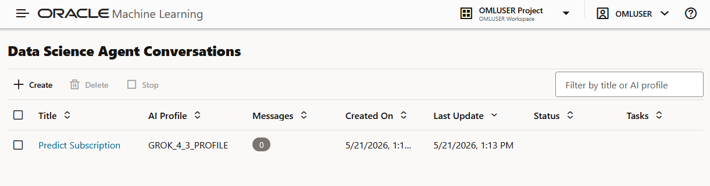
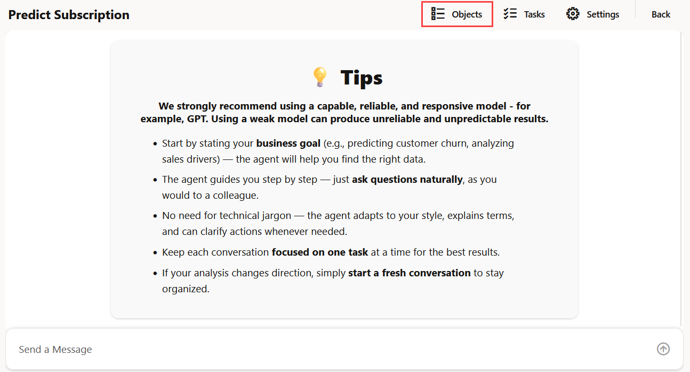
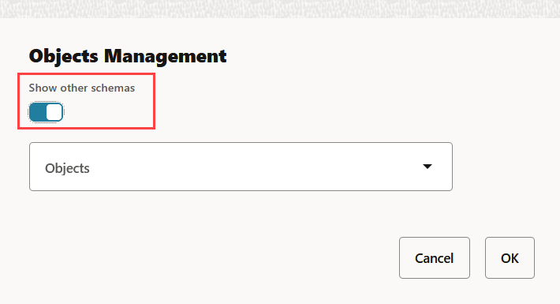
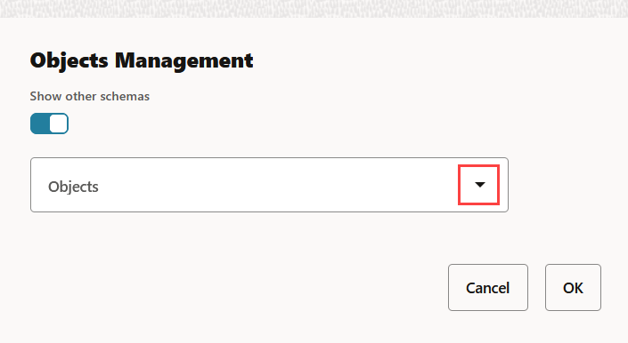
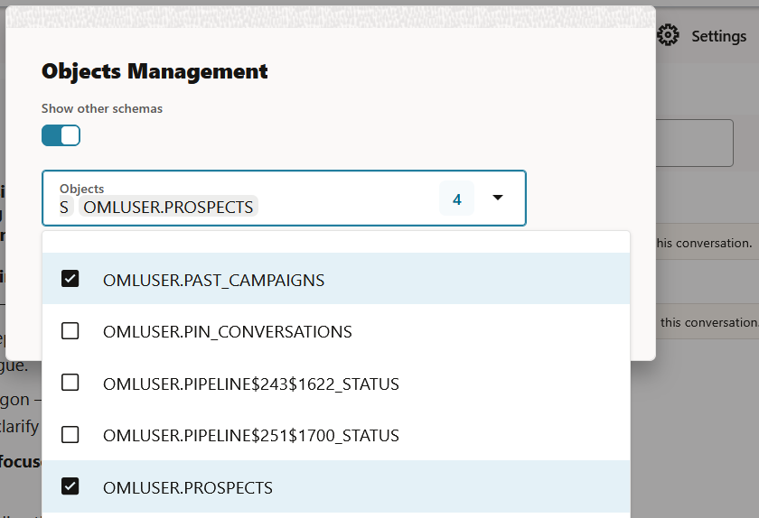
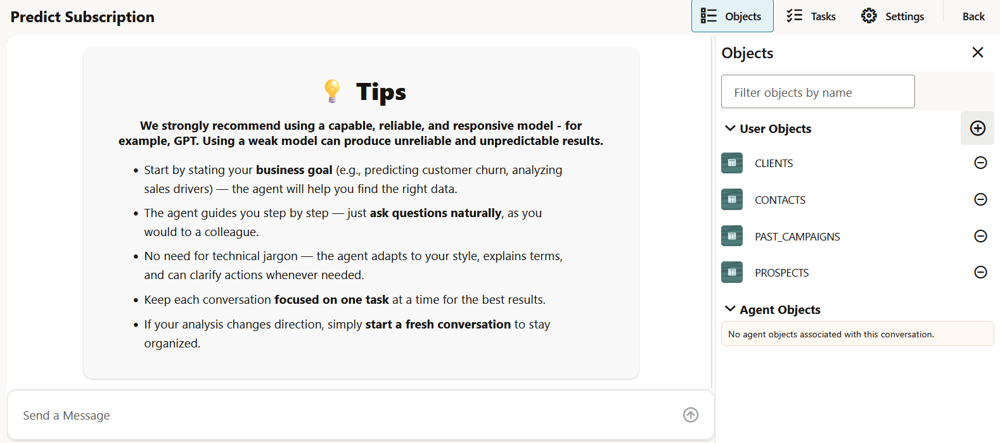
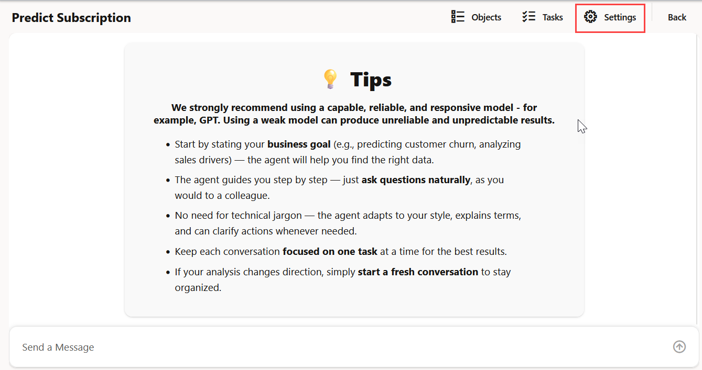
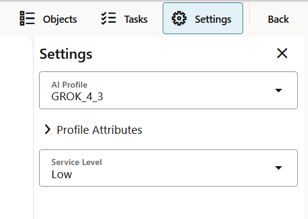
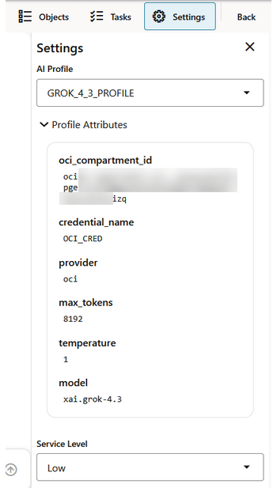

# Configure your Data Science Agent Conversation

## Introduction

In this lab, you will add objects to the `Predict Subscription` Data Science Agent conversation. Objects include tables, views, and machine learning models that Data Science Agent can use during a conversation.

In this workshop, you will use the bank marketing dataset. You will associate multiple dataset objects with the conversation so that Data Science Agent has the context it needs to answer questions and generate useful outputs.

**Estimated Lab Time:** 30 minutes

### Objectives

In this lab, you will:
* Open the `Predict Subscription` conversation
* Open the Objects pane in the Data Science Agent chat interface
* Add bank marketing dataset objects to the conversation
* Verify that the selected objects appear under User Objects
* Review agent-generated objects in the Agent Objects section

### Prerequisites

This lab assumes you have:
* Complete all the previous labs in this workshop
* Created the `Predict Subscription` Data Science Agent conversation
* Access to the Oracle Machine Learning user interface
* Imported the bank marketing dataset
* Access to the `OMLUSER.CLIENTS`, `OMLUSER.CONTACTS`, `OMLUSER.PAST_CAMPAIGNS`, and `OMLUSER.PROSPECTS` objects

> **Note:** To import the bank marketing dataset, import and run the following notebook: `<TBD>`.

## Task 1: Add Objects to your Conversation

To improve the precision and efficiency of Data Science Agent's responses, you can manually add database objects to a conversation. 

In this task, you will open the Objects pane from the Data Science Agent chat interface. The Objects pane shows user objects associated with the conversation and objects created by Data Science Agent. you will add the bank marketing dataset objects to the conversation. These objects provide Data Science Agent with the data context required for later prompts and analysis.

To add objects to your conversation:

1. On the Conversations listing page, click the `Predict Subscription` conversation to open it. The Predict Subscription conversation opens in the Data Science Agent chat interface.

    

2. On the `Predict Subscription` chat interface, click **Objects** on the top right corner of the page. The Objects pane opens on the right side of the page.

    

3. On the Objects pane, click the **+** icon to add objects to the conversation. The Object Management dialog opens. You can also search for objects by typing the object name in the search box.

   

4. In the Object Management dialog, click **Show other schemas** to view objects present in schemas besides your own. 

   

5. In the Objects field, click the down arrow to select objects from the drop-down list. 

    

    Search and select the following tables from the drop-down list:

    
    * `OMLUSER.CLIENTS`
    * `OMLUSER.CONTACTS`
    * `OMLUSER.PAST_CAMPAIGNS`
    * `OMLUSER.PROSPECTS`

    >**Note:** You can associate multiple objects with the conversation.

6. Click **OK**. The selected objects are added to the conversation and are listed under the User Objects section.

    

7. Click **X** to exit the Objects pane. This closes the Objects pane and returns you to the chat interface.

This completes the task of adding objects to the `Predict Subscription` conversation.

## Task 2: Manage AI Profile and Service Level of Data Science Conversation

In this task, you will learn how to change AI Profile and Database Service Levels of a conversation from the Settings option in the Data Science Conversation chat interface. 

> **Note:** These settings are conversation-specific.

To view and edit AI Profile and Database Service level:

1. On the Data Science Agent chat interface, click **Settings** on the top right corner of the page. This opens the Settings pane on the right.

    

2. On the Settings pane, you can manage the following:

    

    * Click **AI Profile** down arrow to select an AI profile for your conversation. 
    
        >**Note:** You can also change the profile in the middle of a conversation.
    * Click **Profile Attributes** down arrow to view the details of the selected AI profile.

        
    * Click **Service Level** down arrow to select a different database service level. By default, the service level is set to `Low`.

3. Click X to exit the Settings pane.
4. Click **Back** to go to the Data Science Agent Conversation listing page.

This completes the task of viewing and editing AI profile and database service level of the `Predict Subscription` conversation.

You may now **proceed to the next lab**.

## Learn More

* [Oracle Machine Learning](https://docs.oracle.com/en/database/oracle/machine-learning/)
* [Oracle Data Science Agent](https://docs.oracle.com/en/database/oracle/machine-learning/data-science-agent/index.html)
* [Oracle Autonomous Database](https://docs.oracle.com/en/cloud/paas/autonomous-database/)
* [Oracle LiveLabs](https://oracle-livelabs.github.io/)

## Acknowledgements

* **Author** - Moitreyee Hazarika, Consulting User Assistance Developer, Oracle AI Database User Assistance Development
* **Contributors** - Mark Hornick, Senior Director, Data Science and Machine Learning; Marcos Arancibia Coddou, Product Manager, Oracle Data Science; Sherry LaMonica, Consulting Member of Tech Staff, Machine Learning
* **Last Updated By/Date** - Moitreyee Hazarika, June 2026
