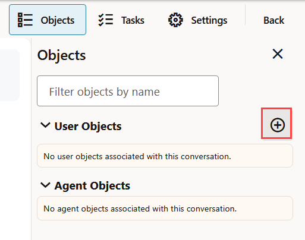
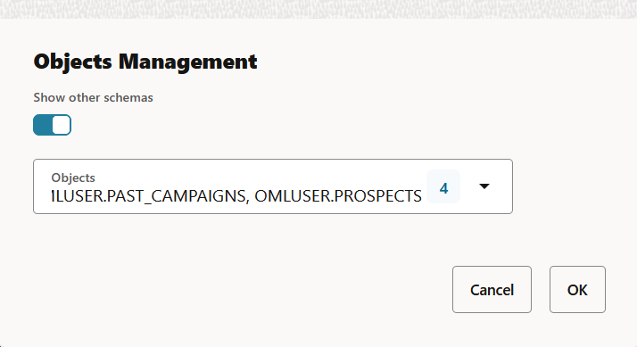
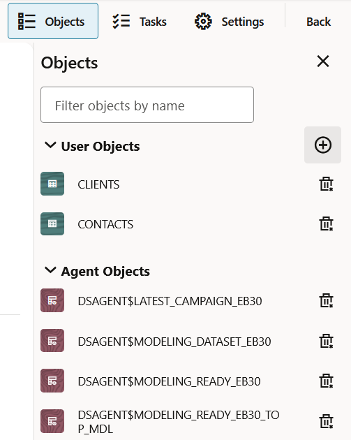

# Lab 4: Add Objects to your Conversation

## Introduction

In this lab, you will add objects to the `Predict Subscription` Data Science Agent conversation. Objects can include tables, views, and machine learning models that Data Science Agent can use during a conversation.

In this workshop, you will use the bank marketing dataset. You will associate multiple dataset objects with the conversation so Data Science Agent has the context it needs to answer questions and generate useful outputs.

**Estimated Lab Time:** 30 minutes

### Objectives

In this lab, you will:
* Open the `Predict Subscription` conversation
* Open the Objects pane in the Data Science Agent chat interface
* Add bank marketing dataset objects to the conversation
* Verify that the selected objects appear under User Objects
* Review agent-generated objects in the Agent Objects section

### Prerequisites

This lab assumes you have:
* Completed all previous labs
* Created the `Predict Subscription` Data Science Agent conversation
* Access to the Oracle Machine Learning user interface
* Imported the bank marketing dataset
* Access to the `OMLUSER.CLIENTS`, `OMLUSER.CONTACTS`, `OMLUSER.PAST_CAMPAIGNS`, and `OMLUSER.PROSPECTS` objects

> **Note:** To import the bank marketing dataset, import and run the following notebook: `<TBD>`.

## Task 1: Open the Predict Subscription Conversation

In this task, you will open the existing Data Science Agent conversation so you can associate dataset objects with it.

1. On the Conversations listing page, click the `Predict Subscription` conversation to open it.

    The expected output should look similar to:

    ```
    The Predict Subscription conversation opens in the Data Science Agent chat interface.
    ```

    

## Task 2: Open the Objects Pane

In this task, you will open the Objects pane from the Data Science Agent chat interface. The Objects pane shows user objects associated with the conversation and objects created by Data Science Agent.

1. On the `Predict Subscription` chat interface, click **Objects** on the top right corner of the page.

    The Objects pane opens on the right side of the page.

    The expected output should look similar to:

    ```
    The Objects pane opens.
    No user objects are associated with this conversation.
    No agent objects are associated with this conversation.
    ```

    

## Task 3: Add Objects to the Conversation

In this task, you will add the bank marketing dataset objects to the conversation. These objects provide Data Science Agent with the data context required for later prompts and analysis.

1. In the Objects pane, click the **+** icon to add objects to the conversation.

    The Object Management dialog opens. You can also search for objects by typing the object name in the search box.

    The expected output should look similar to:

    ```
    The Objects Management dialog opens.
    ```

    

2. In the Object Management dialog, click **Show other schemas** to enable it.

    Enabling this option allows you to select objects from other schemas that are available to your user.

    The expected output should look similar to:

    ```
    Show other schemas is enabled.
    ```

3. Click **Objects** and select the following tables from the drop-down list:

    * `OMLUSER.CLIENTS`
    * `OMLUSER.CONTACTS`
    * `OMLUSER.PAST_CAMPAIGNS`
    * `OMLUSER.PROSPECTS`

    The expected output should look similar to:

    ```
    Selected objects: 4
    OMLUSER.CLIENTS
    OMLUSER.CONTACTS
    OMLUSER.PAST_CAMPAIGNS
    OMLUSER.PROSPECTS
    ```

    

4. Click **OK**.

    The selected objects are added to the conversation and appear under the User Objects section.

    The expected output should look similar to:

    ```
    Objects added successfully.
    User Objects:
    CLIENTS
    CONTACTS
    PAST_CAMPAIGNS
    PROSPECTS
    ```

## Task 4: Verify Conversation Objects

In this task, you will verify that the selected objects were added to the conversation and review the Agent Objects section.

1. In the Objects pane, review the **User Objects** section.

    The selected objects are listed under User Objects.

    The expected output should look similar to:

    ```
    User Objects:
    CLIENTS
    CONTACTS
    PAST_CAMPAIGNS
    PROSPECTS
    ```

    

2. Review the **Agent Objects** section.

    The Agent Objects section lists the objects generated by Data Science Agent during the conversation. These objects can include tables, views, and machine learning models.

    The expected output should look similar to:

    ```
    Agent Objects:
    DSAGENT$LATEST_CAMPAIGN_EB30
    DSAGENT$MODELING_DATASET_EB30
    DSAGENT$MODELING_READY_EB30
    DSAGENT$MODELING_READY_EB30_TOP_MDL
    ```

    > **Note:** Objects created by Data Science Agent are prefixed with `DSAGENT$`. This distinguishes them as agent-generated views, prevents naming conflicts, and enables safe routine cleanup.

3. Click **X** to exit the Objects pane.

    This closes the Objects pane and returns you to the conversation.

    The expected output should look similar to:

    ```
    The Objects pane closes.
    You return to the Predict Subscription conversation.
    ```

This completes the task of adding objects to the `Predict Subscription` conversation.

*[Optional]* You may now **proceed to the next lab**.

## Learn More

* [Oracle Machine Learning](https://docs.oracle.com/en/database/oracle/machine-learning/)
* [Oracle Data Science Agent](https://docs.oracle.com/en/database/oracle/machine-learning/data-science-agent/index.html)
* [Oracle Autonomous Database](https://docs.oracle.com/en/cloud/paas/autonomous-database/)
* [Oracle LiveLabs](https://oracle-livelabs.github.io/)

## Acknowledgements

* **Author** - Moitreyee Hazarika, Consulting User Assistance Developer, Oracle AI Database User Assistance Development
* **Contributors** - Mark Hornick, Senior Director, Data Science and Machine Learning; Marcos Arancibia Coddou, Product Manager, Oracle Data Science; Sherry LaMonica, Consulting Member of Tech Staff, Machine Learning
* **Last Updated By/Date** - Moitreyee Hazarika, June 2026
