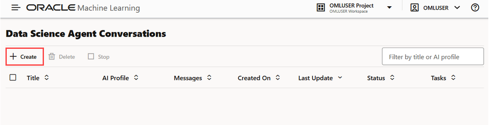
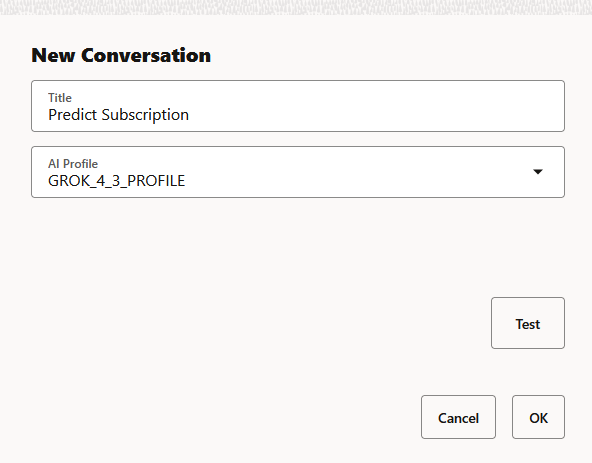
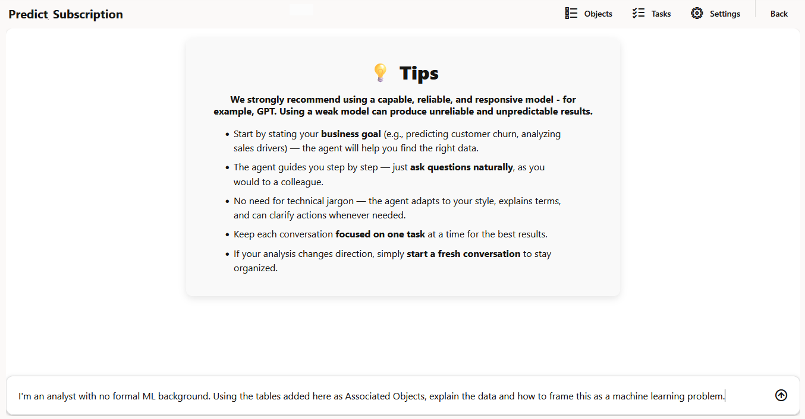

# Create a Data Science Agent Conversation

## Introduction

In this lab, you will create a Data Science Agent conversation. 

A conversation is a set of interactions with Data Science Agent in the chat interface. Before you can ask questions or submit natural language prompts, you must create a conversation and associate it with a tested AI profile.

You will open the Data Science Agent Conversations page, create a new conversation, select an AI profile, test the profile, and open the chat interface where you can begin interacting with Data Science Agent.

**Estimated Lab Time:** 15 minutes

### Objectives

In this lab, you will:
* Create a new Data Science Agent conversation
* Select and test an AI profile
* Open the chat interface and submit a natural language prompt

### Prerequisites

This lab assumes you have:
* Completed all previous labs
* Access to Oracle Machine Learning
* Access to Data Science Agent
* A configured and enabled AI profile named `GROK_4_3_PROFILE`
* Database user credentials for the OML workspace

## Task 1: Create a Data Science Agent conversation

To create a Data Science Agent conversation, you will open the Data Science Agent Conversations page and start the conversation creation workflow.

> **Note:** You can use the same Database user credentials to access the same conversation in multiple browsers. However, Oracle does not recommend this as it may lead to unexpected behavior. If you attempt this, Data Science Agent will display a warning, but you will have the option to override it.

To create a Data Science Agent conversation:

1. On the Oracle Machine Learning UI home page, click **Data Science Agent**. Alternatively, you can click the Cloud menu icon to open on the left navigation menu and click **Data Science Agent**. This opens the Data Science Conversations page.

2. On the **Data Science Agent Conversations** page, click **Create**.

    This action opens the **New Conversation** dialog, where you can define the conversation title and select the AI profile that Data Science Agent will use.

    

3. In the **New Conversation** dialog, define the following:

    

    * In the **Title** field, provide a name for your conversation. In this example, enter `Predict Subscription`.

    * In the **AI Profile** drop-down menu, click the down arrow and select `GROK_4_3_PROFILE`. Data Science Agent uses this AI profile to process prompts submitted in the conversation.

4. Click **Test** to validate the selected AI profile before creating the conversation. The profile test confirms that the selected profile can be used by Data Science Agent.

    The expected output should look similar to:

    ```
    AI profile test succeeded

    The AI profile GROK_4_3_PROFILE was tested successfully.
    ```

    

    > **Note:** AI profiles may show warnings if the parameters `model`, `temperature`, or `max_tokens` are outside the recommended Data Science Agent ranges. However, a warning does not necessarily mean the profile cannot be selected. Review the warning before continuing.

    > **Note:** Profile test failures can be caused by Access Control List (ACL), missing or deleted credentials, invalid credentials, invalid model, timeout, or unexpected `DBMS_CLOUD_AI.GENERATE` errors. To resolve errors, check ACL access, credential validity, model availability, and the request ID shown in the error.

5. Click **OK**. The conversation is created only if the selected profile test succeeds. After the conversation is created, Data Science Agent opens the chat interface.
   

## Task 2: Start Chatting with Data Science Agent

In this task, you will begin interacting with Data Science Agent by submitting a natural language prompt.

1. Review the tips displayed in the chat interface. Data Science Agent presents tips to help you begin the conversation and understand the types of prompts you can submit.

    

2. In the **Send a message** field, enter your prompt in natural language and press **Enter**.

    Use a natural language prompt to begin the interaction. Data Science Agent processes the prompt using the AI profile associated with the conversation.


You may now **proceed to the next lab**.

## Learn More

* [Oracle Machine Learning](https://docs.oracle.com/en/database/oracle/machine-learning/)
* [Oracle Data Science Agent](https://docs.oracle.com/en/database/oracle/machine-learning/data-science-agent/index.html)
* [Oracle Autonomous Database](https://docs.oracle.com/en/cloud/paas/autonomous-database/)
* [Oracle LiveLabs](https://oracle-livelabs.github.io/)

## Acknowledgements

* **Author** - Moitreyee Hazarika, Consulting User Assistance Developer, Oracle AI Database User Assistance Development
* **Contributors** - Mark Hornick, Senior Director, Data Science and Machine Learning; Marcos Arancibia Coddou, Product Manager, Oracle Data Science; Sherry LaMonica, Consulting Member of Tech Staff, Machine Learning
* **Last Updated By/Date** - Moitreyee Hazarika, June 2026
