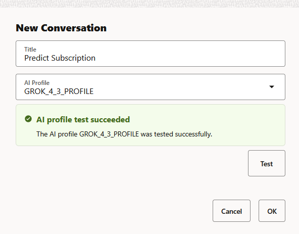

WORKSHOP: Introduction to Oracle Data Science Agent
THIS IS: Lab 2: Create a Data Science Agent Conversation  
ESTIMATED TIME: 120 minutes

# Create a Data Science Agent Conversation

## Introduction

In this lab, you will create a Data Science Agent conversation in Oracle Machine Learning. A conversation is a set of interactions with Data Science Agent in the chat interface. Before you can ask questions or submit natural language prompts, you must create a conversation and associate it with a tested AI profile.

You will open the Data Science Agent Conversations page, create a new conversation, select an AI profile, test the profile, and open the chat interface where you can begin interacting with Data Science Agent.

**Estimated Lab Time:** 10 minutes

### Objectives

In this lab, you will:
* Open the Data Science Agent Conversations page
* Create a new Data Science Agent conversation
* Select and test an AI profile
* Open the chat interface and submit a natural language prompt

### Prerequisites

This lab assumes you have:
* Completed all previous labs
* Access to Oracle Machine Learning
* Access to Data Science Agent
* A configured and enabled AI profile named `GROK_4_3_PROFILE`
* Database user credentials for the OML workspace

## Task 1: Open the Data Science Agent Conversations Page

In this task, you will open the Data Science Agent Conversations page and start the conversation creation workflow.

1. On the **Data Science Agent Conversations** page, click **Create**.

    This action opens the **New Conversation** dialog, where you can define the conversation title and select the AI profile that Data Science Agent will use.

    

    The expected output should look similar to:

    ```
    The New Conversation dialog is displayed.
    ```

## Task 2: Configure the New Conversation

In this task, you will provide the conversation details, select the AI profile, and test the profile before creating the conversation.

1. In the **New Conversation** dialog, enter a conversation title.

    In the **Title** field, provide a name for your conversation. In this example, enter `Predict Subscription`.

    

    The expected output should look similar to:

    ```
    Title: Predict Subscription
    ```

2. Select the AI profile.

    In the **AI Profile** drop-down menu, click the down arrow and select `GROK_4_3_PROFILE`. Data Science Agent uses this AI profile to process prompts submitted in the conversation.

    The expected output should look similar to:

    ```
    AI Profile: GROK_4_3_PROFILE
    ```

3. Test the selected AI profile.

    Click **Test** to validate the selected AI profile before creating the conversation. The profile test confirms that the selected profile can be used by Data Science Agent.

    The expected output should look similar to:

    ```
    AI profile test succeeded

    The AI profile GROK_4_3_PROFILE was tested successfully.
    ```

    

    > **Note:** AI profiles may show warnings if the parameters `model`, `temperature`, or `max_tokens` are outside the recommended DSAgent ranges. A warning does not necessarily mean the profile cannot be selected. Review the warning before continuing.

    > **Note:** Profile test failures can be caused by Access Control List (ACL), missing or deleted credentials, invalid credentials, invalid model, timeout, or unexpected `DBMS_CLOUD_AI.GENERATE` errors. To resolve errors, check ACL access, credential validity, model availability, and the request ID shown in the error.

## Task 3: Create the Conversation

In this task, you will create the conversation after the selected AI profile test succeeds.

1. Click **OK**.

    The conversation is created only if the selected profile test succeeds. After the conversation is created, Data Science Agent opens the chat interface.

    The expected output should look similar to:

    ```
    Conversation created successfully.
    The Data Science Agent chat interface opens.
    ```

    

## Task 4: Start Chatting with Data Science Agent

In this task, you will begin interacting with Data Science Agent by submitting a natural language prompt.

1. Review the tips displayed in the chat interface.

    Data Science Agent presents tips to help you begin the conversation and understand the types of prompts you can submit.

    The expected output should look similar to:

    ```
    Data Science Agent displays tips for starting your conversation.
    ```

2. In the **Send a message** field, enter your prompt in natural language and press **Enter**.

    Use a natural language prompt to begin the interaction. Data Science Agent processes the prompt using the AI profile associated with the conversation.

    The expected output should look similar to:

    ```
    Your prompt is submitted.
    Data Science Agent begins processing the request.
    ```

    

*[Optional]* You may now **proceed to the next lab**.

## Learn More

* [Oracle Machine Learning](https://docs.oracle.com/en/database/oracle/machine-learning/)
* [Oracle Data Science Agent](https://docs.oracle.com/en/database/oracle/machine-learning/data-science-agent/index.html)
* [Oracle Autonomous Database](https://docs.oracle.com/en/cloud/paas/autonomous-database/)
* [Oracle LiveLabs](https://oracle-livelabs.github.io/)

## Acknowledgements

* **Author** - Moitreyee Hazarika, Consulting User Assistance Developer, Oracle AI Database User Assistance Development
* **Contributors** - Mark Hornick, Senior Director, Data Science and Machine Learning; Marcos Arancibia Coddou, Product Manager, Oracle Data Science; Sherry LaMonica, Consulting Member of Tech Staff, Machine Learning
* **Last Updated By/Date** - Moitreyee Hazarika, November 2026
