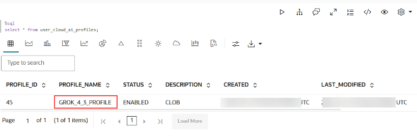

# Create OCI Generative AI Credential and AI Profile  for use with Data Science Agent

## Introduction

In this lab, you will create an OCI Generative AI Credential and an AI profile. You will define the AI profile for use with Data Science Agent (DSA). 

Autonomous AI Database uses AI profiles to configure access to a large language model (LLM), generate SQL from natural language prompts, run SQL, explain SQL, and support retrieval augmented generation with embedding models and vector indexes.

You will also grant the required OML role to the OML user and configure host Access Control List (ACL) access for model providers that require outbound network access.

**Estimated Lab Time:** 30 minutes

### Objectives

In this lab, you will:

* Create an OCI Generative AI Credential
* Create an AI profile using `DBMS_CLOUD_AI`
* Grant the `OML_DEVELOPER` role to an OML user
* Add the OML user to the host ACL for OpenAI access
* Verify each configuration step

### Prerequisites

This lab assumes you have:
* Completed the previous lab
* Access to an Autonomous AI Database
* Administrator privileges or equivalent permissions
* An OML user, such as `OMLUSER`
* A configured credential for the model provider, such as `openai_cred`
* DBMS_CLOUD_AI package
* user_ocid
* tenancy_ocid
* private_key
* fingerprint

## Task 1: Create an OCI Generative AI Credential and an AI Profile

An AI credential stores authentication details that the database uses to access the selected AI provider or related cloud resources. Depending on the provider, it may contain an API key, OCI signing key details, or other provider-specific authentication fields. The credential comprises the following information:

* `user_ocid`: This is the unique identifier of the OCI user.
* `tenancy_ocid`: This is the unique identifier of the OCI tenancy in your cloud account.
* `private_key`: The private key associated with the OCI user. It is required for secure authentication.
* `fingerprint`: The fingerprint of the public key linked to the OCI user.

To create an OCI Generative AI credential:

1. Create a notebook and in a %script paragraph, run the following command: 

    ```sql
    <copy>
    %script

    DECLARE
    credential_name VARCHAR2(128) := 'OCI_CRED';
    BEGIN
    BEGIN
    dbms_cloud.drop_credential(credential_name => credential_name);
    EXCEPTION
    WHEN OTHERS THEN
    NULL;
    END;
    dbms_cloud.create_credential(
    credential_name => credential_name,
    user_ocid       => '<ocid1.user.oc1..>',
    tenancy_ocid    => '<ocid1.tenancy.oc1..>',
    private_key     => '<private_key>',
    fingerprint     => '<fingerprint>'
    );
    END;
    /
    </copy>
    ```

    This PL/SQL script calls the `DBMS_CLOUD.CREATE_CREDENTIAL` procedure to create a new credential with the given parameters:

    * `credential_name`: Name of the credential. In this example, the credential name is `OCI_CRED`.
    * `user_ocid`: This is the Oracle Cloud Identifier, a unique ID for the user. See Where to Get the Tenancy's OCID and User's OCID for details.
    * `tenancy_ocid`: This is the Oracle Cloud Identifier for your tenancy (your OCI account). See Where to Get the Tenancy's OCID and User's OCID for details.
    * `private_key`: Specify the generated private key. Private keys generated with a passphrase are not supported. You must generate the private key without a passphrase. See How to Generate an API Signing Key for details.
    * `fingerprint`: Specify the fingerprint. After a generated public key is uploaded to your account the fingerprint is displayed in the console. Use the displayed fingerprint for this argument. See How to Get the Key's Fingerprint and How to Generate an API Signing Key for more information.


## Task 2: Create an AI Profile 

Use `DBMS_CLOUD_AI` to Configure AI Profiles

AI profiles define how Autonomous AI Database connects to an LLM and which profile attributes are used for natural language to SQL translation. These profiles can include metadata from database objects such as table names, column names, column data types, and comments.

1. In another `%script` paragraph in the same notebook, run the following command to create an AI profile by the name `GROK_4_3_PROFILE`. This script uses the `DBMS_CLOUD_AI.CREATE_PROFILE` procedure.

    This procedure creates a new AI profile. The profile can later be used to translate natural language prompts into SQL statements and to configure access to an LLM provider.

    ```sql
    <copy>
    %script

    DECLARE
        profile_name VARCHAR2(128) := 'GROK_4_3_PROFILE';
    BEGIN
        dbms_cloud_ai.drop_profile(
            profile_name,
            TRUE
        );
        dbms_cloud_ai.create_profile(
            profile_name => profile_name,
            attributes   => '{
                "credential_name": "OCI_CRED",
                "model": "xai.grok-4.3",
                "provider": "oci",
                "temperature": 1,
                "max_tokens": 8192,
                "oci_compartment_id": "<ocid1.compartment.oc1..>"
            }'
        );
    END;
    /
    </copy>
    ```

    Define the following attributes for this profile:

* `profile_name`: A name for the AI profile. The profile name must follow the naming rules of Oracle SQL identifier. The maximum profile name length is 125 characters.
* `credential_name`: This is the name of the credential used to authenticate requests to the selected AI provider.
* `model`: The name of the AI model being used to generate responses in the conversation. In this example, it is xai.grok-4.3. For more information, see Recommended Models.
* `provider`: This is the provider of the model. It is a mandatory field. Supported providers are:
    * openai
    * cohere
    * azure
    * database
    * oci
    * google
    * anthropic
    * huggingface
    * aws
* `max_tokens`: Specify the maximum number of tokens (words and pieces of words) in the response. Prevents overly long outputs and manages cost.
* `oci_compartment_id`: This is the OCID of the compartment you are permitted to access when calling the OCI Generative AI service. The compartment ID can contain alphanumeric characters, hyphens and dots.

2. Check the status of the profile creation by running the following:

    ```sql
    <copy>
    %sql 
    select * from
    user_cloud_ai_profiles;
    </copy>
    ```
    


## Task 3: Grant `OML_DEVELOPER` Role to OML User

To use Data Science Agent, the administrator must grant the `OML_DEVELOPER` role to the OML user. 

> **Note:** If the OML user, such as `OMLUSER`, is created through Database Actions, the `OML_DEVELOPER` role is automatically granted.

1. Grant the `OML_DEVELOPER` role to the OML user.

    Run the following command as an administrator to grant the role required for Data Science Agent access.

    ```sql
    <copy>
    GRANT OML_DEVELOPER to OMLUSER
    </copy>
    ```

    The expected output should look similar to:

    ```
    Grant succeeded.
    ```


## Task 3: Add User to the Host ACL

For model providers such as OpenAI, you must add users to the host ACL (Access Control List). This allows the database user to access the model provider endpoint.

> **Note:** Host ACL entry is not required for OCI GenAI.

1. Add `OMLUSER` to the host ACL.

    Run the following procedure to grant the privilege to use the `api.openai.com` endpoint. This allows `OMLUSER` to make HTTP requests to the OpenAI API host.

    ```sql
    <copy>
    BEGIN
        DBMS_NETWORK_ACL_ADMIN.APPEND_HOST_ACE(
             host => 'api.openai.com',
             ace  => xs$ace_type(privilege_list => xs$name_list('http'),
                                 principal_name => 'OMLUSER',
                                 principal_type => xs_acl.ptype_db)
       );
    END;
    </copy>
    ```

    The expected output should look similar to:

    ```
    PL/SQL procedure successfully completed.
    ```
Here, the parameters are:

* `host`: The host, which can be the name or the IP address of the host. You can use a wildcard to specify a domain or an IP subnet. The host or domain name is not case sensitive.
* `ace`: The access control entries (ACE). The XS$ACE_TYPE type is provided to construct each ACE entry for the ACL.


You may now **proceed to the next lab**.

## Learn More

* [Oracle Machine Learning](https://docs.oracle.com/en/database/oracle/machine-learning/)
* [Oracle Data Science Agent](https://docs.oracle.com/en/database/oracle/machine-learning/data-science-agent/index.html)
* [Oracle Autonomous Database](https://docs.oracle.com/en/cloud/paas/autonomous-database/)
* [Oracle LiveLabs](https://oracle-livelabs.github.io/)

## Acknowledgements

* **Author** - Moitreyee Hazarika, Consulting User Assistance Developer, Oracle AI Database User Assistance Development
* **Contributors** - Mark Hornick, Senior Director, Data Science and Machine Learning; Marcos Arancibia Coddou, Product Manager, Oracle Data Science; Sherry LaMonica, Consulting Member of Tech Staff, Machine Learning
* **Last Updated By/Date** - Moitreyee Hazarika, November 2026
