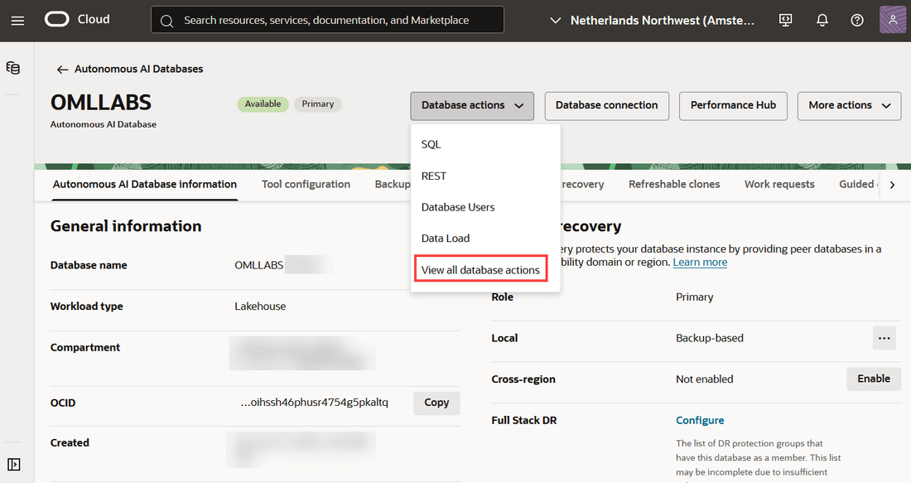
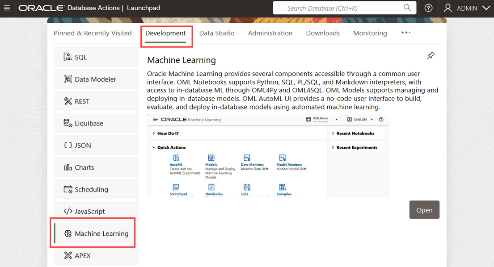
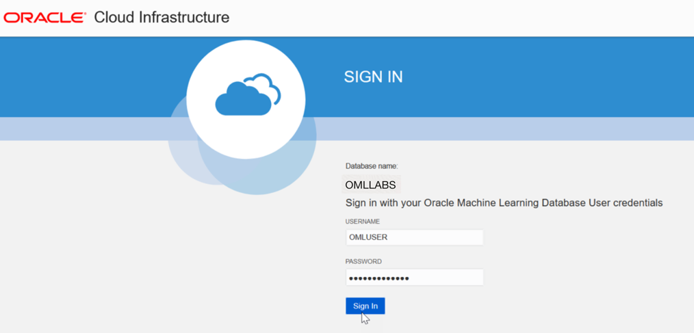
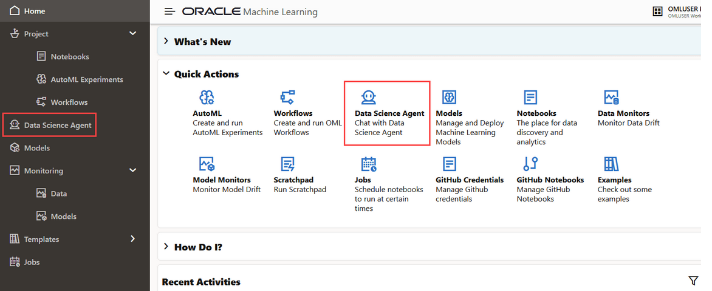
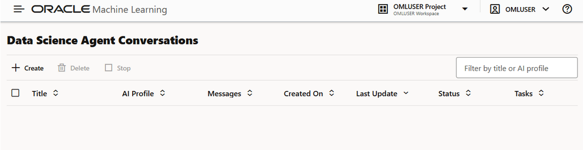

# Introduction to Oracle Data Science Agent

## Introduction

Data Science Agent is an intelligent built-in conversational chatbot integrated with Oracle Machine Learning UI included in your Oracle Autonomous AI Database subscription. You must provide the LLM, specified through your AI profile, whether from a third-party AI provider, OCI GenAI Service, or one you privately host. You can run complete data science workflows using natural language in the Data Science Agent chat.

As a human-in-the-loop chatbot, Data Science Agent requires your intervention and approval in the following areas:

* **Object association:** Associating database objects with a conversation improves precision and efficiency. Objects must be associated or approved before the agent creates views that use them; other supported operations may still use accessible objects based on the user's database privileges.
* **Conversation management:** The scope of Data Science Agent is limited to the active conversation context only. You must create, manage, and delete your conversations.
* **Profile selection:** You must select an AI profile, and therefore, the LLM that powers the agent. You can also switch profiles mid-conversation.
* **Approval for object view:** During any conversation, Data Science Agent compares the object_list with the objects already associated with the active conversation. If required, the agent proposes any table or view outside the user-approved set. It stops the conversation and explicitly seeks your approval to associate those missing objects before continuing. If you approve associating the missing objects, the association is recorded and the agent continues the conversation. Else, the operation is canceled and no view is created.

Estimated Time: X

### Objectives
In this lab, you will learn how to:

* Access and use the Oracle Machine Learning Data Science Agent
* Create AI Credential and AI Profile
* Create a Data Science Conversation
* Use the Data Science Agent chat interface
* Issue sequence of prompts to perform sequences of machine learning tasks

### Prerequisites

This workshop requires access to your Oracle Machine Learning UI in Oracle Autonomous AI Database. You may use your own cloud account or a training account whose details were given to you by an Oracle instructor.

* Familiarity with OML UI
* Familiarity with Oracle Autonomous AI Database
* Familiarity with Oracle Cloud Infrastructure (OCI) GenAI Service
* Access to OCI GenAI Services LLM

## Task 1: Access Oracle Data Science Agent

You can access Data Science Agent directly from Oracle Machine Learning UI home page.
To access Data Science Agent, you must first sign into Oracle Machine Learning UI from Autonomous AI Database. To sign into Oracle Machine Learning from an Autonomous AI Database instance:

1. On the Autonomous AI Database information page click **Database actions** and then click **View all database actions**. The Database Actions Launchpad opens. 

   

2. On the Database Actions page, go to the **Development** tab and click **Machine Learning**. The Oracle Machine Learning UI sign in page opens.

    

3. On the Oracle Machine Learning UI sign in page, enter your username and password, and click **Sign in**. The Oracle Machine Learning UI home page opens.
    

4. On your Oracle Machine Learning UI home page, click **Data Science Agent**. Alternatively, you can click the Cloud menu icon to open on the left navigation menu. Here, click **Data Science Agent**.

    

5. This opens the Data Science Conversations listing page.

    

## Task 2: Review the recommended models for use with Data Science Agent 

Data Science Agent works with large language models accessed through Oracle `DBMS_CLOUD_AI` and `DBMS_CLOUD_AI_AGENT` packages. The `DBMS_CLOUD_AI` package, with Select AI, supports the translation of natural language prompts to generate, run, explain SQL statements, and also enables RAG and natural language-based interactions, including chats with LLMs.
This table lists the recommended large language models and the scenarios in which each should be used.
| Provider      |      Tier     |  Large Language Model |
| ------------- | -----------   | ----------------------|
| OpenAI or OCI GenAI | Top            | gpt-5.5                     |
| OpenAI or OCI GenAI | Cost-effective | gpt-5.4-mini                |
| OCI GenAI           | Top            | xai.grok-4.3                |
| OCI GenAI           | Cost-effective | xai.grok-4-1-fast-reasoning |
| Google              | Top            | gemini-3.5-flash            |
| Google              | Cost-effective | gemini-3-flash-preview      |
| Anthropic           | Top            | claude-opus-4-8             |
| Anthropic           | Cost-effective | claude-sonnet-4-6           |
{: title="Recommended Models"}

>**Note:** When using OCI Generative AI, use the provider and model identifiers exactly as documented for OCI GenAI. Some model identifiers may include the original model family or vendor name.

Explanation of tiers:

* **Top:** Represents the best state-of-the-art model from a specific provider. This tier is the strongest option in terms of quality, reliability, and precision.
* **Cost-effective:** Represents a good compromise between quality, cost, and speed. These models are typically faster and less expensive. But the trade-off is lower quality and reliability compared to the Top tier.

For more information, refer to [Using Oracle Data Science Agent](https://docs.oracle.com/en/database/oracle/machine-learning/data-science-agent/dsaug/dsa-best-practices.html)

You may now **proceed to the next lab**.

> **Note:** If you have a Free Trial account, when your Free Trial expires your account will be converted to an **Always Free** account. You will not be able to conduct Free Tier workshops unless the Always Free environment is available. **[Click here for the Free Tier FAQ page.](https://www.oracle.com/cloud/free/faq.html)**

## Learn More

Use these links to get more information about Oracle Machine Learning and Oracle Cloud Infrastructure:

* [Using Oracle Data Science Agent](https://docs.oracle.com/en/database/oracle/machine-learning/data-science-agent/dsaug/index.html)
* [Oracle Cloud Infrastructure Documentation](https://docs.cloud.oracle.com/iaas/Content/GSG/Reference/gettingstartedwithPaaS.htm)
* [Overview of Oracle Cloud Infrastructure Identity and Access Management (IAM)](https://docs.cloud.oracle.com/en-us/iaas/Content/Identity/Concepts/overview.htm)
* [Oracle Cloud Infrastructure Self-paced Learning Modules](https://www.oracle.com/cloud/iaas/training/foundations.html)
* [Oracle LiveLabs](https://livelabs.oracle.com/ords/r/dbpm/livelabs/home)

## Acknowledgements
* **Author** : Moitreyee Hazarika, Consulting User Assistance Developer, Database User Assistance Development
* **Contributors**: Mark Hornick, Senior Director, Data Science and Machine Learning; Marcos Arancibia Coddou, Product Manager, Oracle Data Science; Sherry LaMonica, Consulting Member of Tech Staff, Machine Learning
* **Last Updated By/Date**: Moitreyee Hazarika, July 2026
