# Issue prompts to perform Data Science and Machine Learning tasks

## Introduction

In this lab, you will issue a sequence of prompts to Data Science Agent to perform data science and machine learning tasks. You will run a complete machine learning workflow using natural language, progressing from general questions about the data in the `OMLUSER` schema to model training, model building, evaluation, and scoring.

By the end of this lab, you will see how Data Science Agent supports a novice user in exploring the dataset present in the `OMLUSER` schema and in building and evaluating a machine learning model. You will use natural language to prepare data, generate SQL, create visualizations, train models, interpret model results, and score prospects.

>**Note:** This is an agent-driven workflow. Outputs can vary by model, profile, seed, data state, and previous conversation context. Your generated object names and model results may differ. Use the names shown in your response.

**Estimated Lab Time:** 30 minutes

### Objectives

In this lab, you will:
* Set the goal and context for a Data Science Agent conversation
* Explore the `CLIENTS`, `CONTACTS`, `PAST_CAMPAIGNS`, and `PROSPECTS` tables
* Frame subscription likelihood as a machine learning problem
* Create a single modeling table from multiple source tables
* Perform feature validation and prepare a clean modeling view
* Split data into training, validation, and test sets
* Train and evaluate a model to predict subscription likelihood
* Score prospects by using the trained model

### Prerequisites

This lab assumes you have:
* Completed all previous labs
* Access to Data Science Agent
* The `CLIENTS`, `CONTACTS`, `PAST_CAMPAIGNS`, and `PROSPECTS` tables added as Associated Objects
* Access to the `OMLUSER` schema

>**Note:**  The output in this lab are examples. The suffixes, selected algorithm, metrics, row counts, and names of models and views may differ when you run the workshop in your environment. Use the object names generated in your session wherever needed.

## Task 1: Set the conversation goal and context

In this task, continue the `Predict Subscription` conversation you created in Lab 3: Create a Data Science Conversation. Provide enough context for the agent to understand your role, your experience level, and the data you want to explore. This helps the agent tailor its response and explain the machine learning workflow in an accessible way.

1. Open the `Predict Subscription` conversation, and review the tips displayed in the chat interface.

    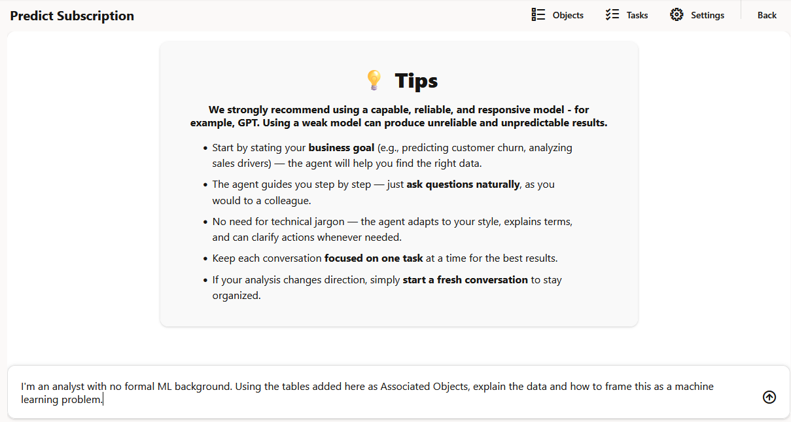

2. Enter the following prompt to set the goal and context for the conversation. This prompt tells Data Science Agent that you are an analyst without formal machine learning experience and asks it to explain the data and the machine learning framing.

    ```text
    <copy>
    I'm an analyst with no formal ML background. Using the tables added here as Associated Objects, explain the data and how to frame this as a machine learning problem.
    </copy>
    ```

    The expected output should look similar to:

    ```text
    Data Science Agent summarizes the available tables, describes key columns, and explains how the data can be framed as a supervised machine learning problem.
    ```

3. Review the summary of the data in each table and the key columns identified by Data Science Agent.

    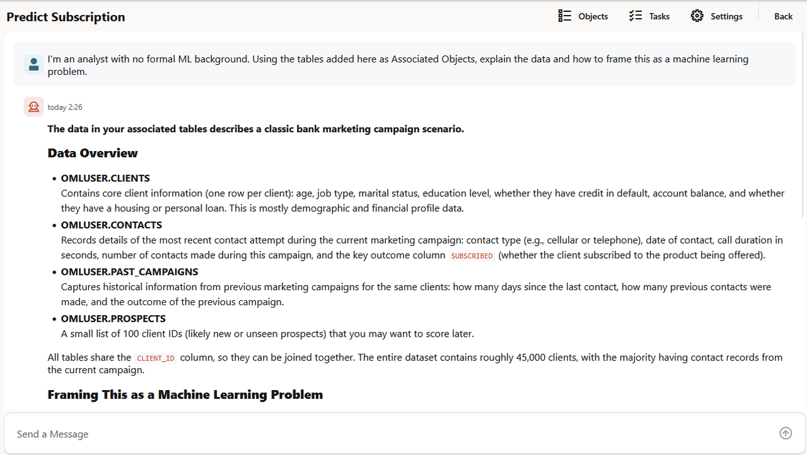

4. Review the explanation of how to frame a machine learning problem, the steps required to frame the problem, and the summary of the dataset.

    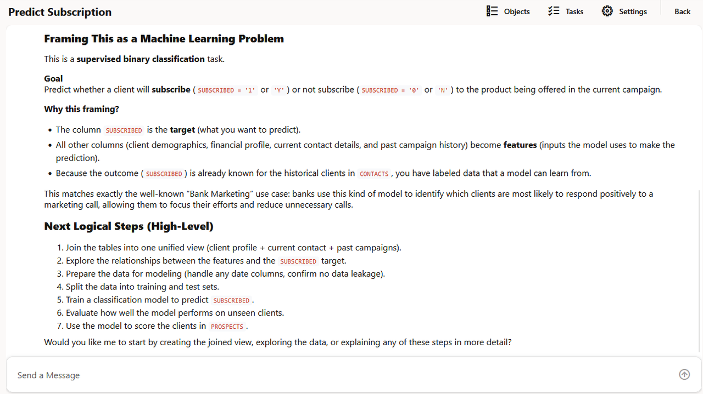

## Task 2: Explore the dataset

In this task, you will ask Data Science Agent to explore the dataset and provide basic statistics. This helps you understand table contents, attribute distributions, and data patterns before moving into feature engineering and modeling.

1. Enter the following prompt to request basic statistics about the available data. This prompt asks Data Science Agent to inspect the Associated Objects and summarize the dataset in a structured way.

    ```text
    <copy>
    Show some basic statistics about the data.
    </copy>
    ```

    The expected output should look similar to:

    ```text
    Data Science Agent provides insights for the CLIENTS, CONTACTS, PAST_CAMPAIGNS, and PROSPECTS tables, including row-level summaries and attribute-level statistics.
    ```

2. Review the initial response, including the insight on the `CLIENTS`, `CONTACTS`, `PAST_CAMPAIGNS`, and `PROSPECTS` tables.

    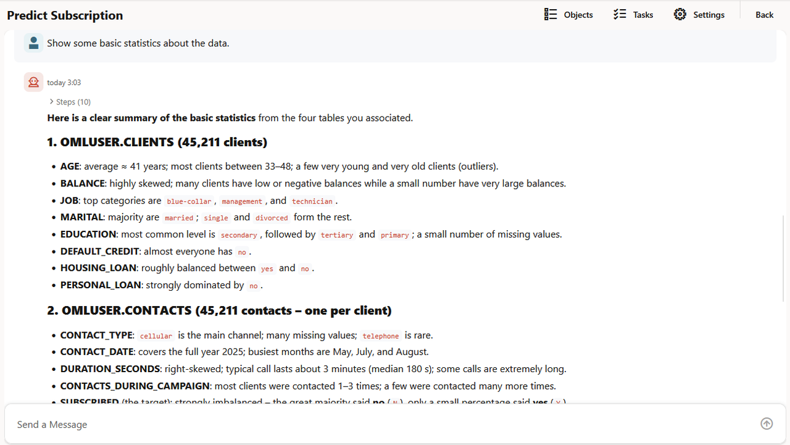

3. Expand the **Attribute Statistic** section for each table. Data Science Agent presents statistical analysis in a tabular format and, where applicable, as graphs.

    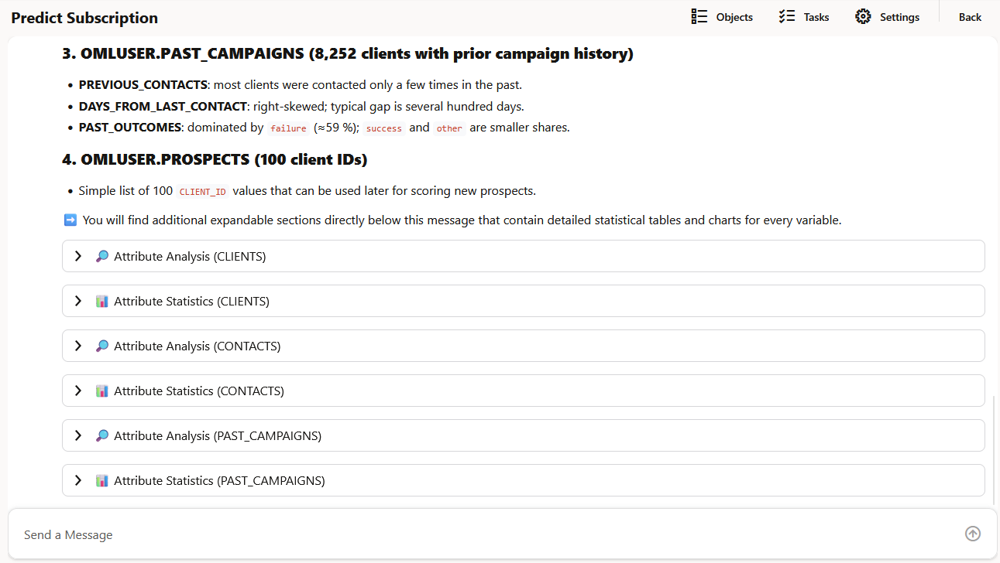

    The expected output should look similar to:

    ```text
    Attribute statistics are available for each table. Numeric columns show values such as counts, minimums, maximums, averages, and distributions.
    ```

4. Expand the **Attribute Analysis** section for each table. Data Science Agent presents attribute-level analysis in a tabular format and, where applicable, as graphs.

    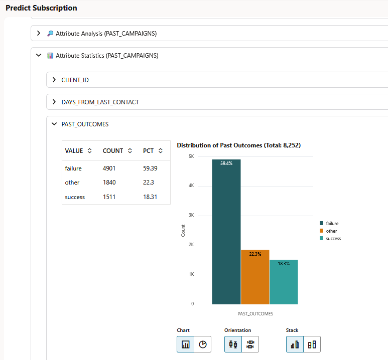

## Task 3: Frame the data as a machine learning problem

In this task, you will ask Data Science Agent to explain how the available tables can be used to predict subscription likelihood. This establishes the target variable, candidate input features, and the overall supervised learning setup.

1. Enter the following prompt to ask Data Science Agent to frame the use case as a machine learning problem. This prompt focuses the conversation on predicting subscription likelihood and asks for the target variable and possible input features.

    ```text
    <copy>
    Explain how to frame this as a machine learning problem to predict subscription likelihood. Explain the target variable and the possible input features.
    </copy>
    ```

    The expected output should look similar to:

    ```text
    Data Science Agent explains the prediction goal, identifies the target variable, and lists candidate input features from the available tables.
    ```

2. Review the explanation of how to frame the machine learning problem and how the target variable is defined.

    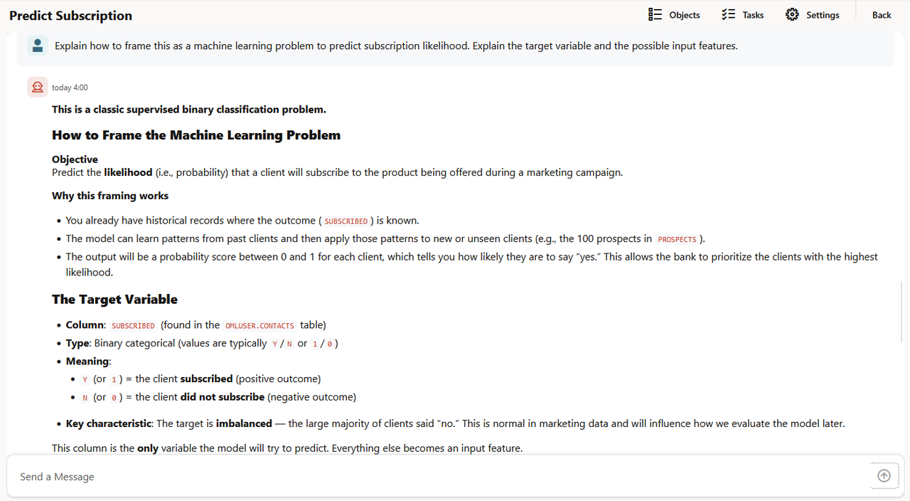

3. Review the input feature explanation, the summary of the machine learning setup, and the suggested next steps.

    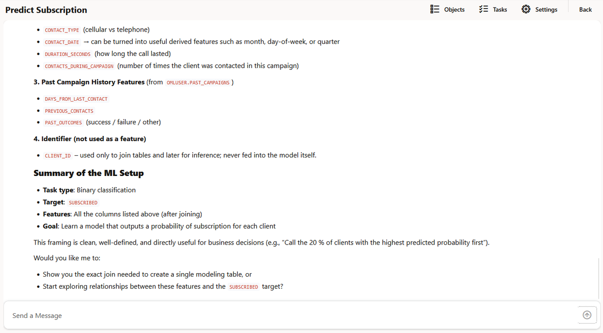

## Task 4: Create a single modeling table

In this task, you will ask Data Science Agent to show the joins required to create a single modeling table. A single modeling table is useful because model training typically requires one row per training example with the target variable and input features in the same dataset.

1. Enter the following prompt to ask Data Science Agent to create the unified modeling table and show the exact joins. This prompt moves the workflow from conceptual framing into data preparation.

    ```text
    <copy>
    Yes. Show the exact joins to create a single modeling table.
    </copy>
    ```

    The expected output should look similar to:

    ```text
    Data Science Agent creates the unified modeling view DSAGENT$MODELING_DATA_A6CB and explains the join logic used to combine the source tables.
    ```

2. Review the response showing the unified modeling view `DSAGENT$MODELING_DATA_A6CB`, the summary of the view, and the explanation of the join logic.

    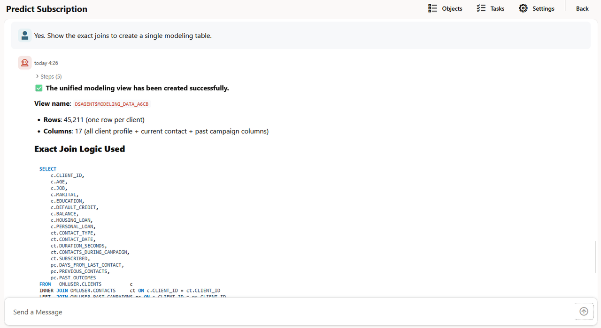

    > **Note:** Views and objects created by Data Science Agent have the prefix `DSAGENT$`.

3. Review the join type summary, generated SQL code, and visual diagram for the view.

    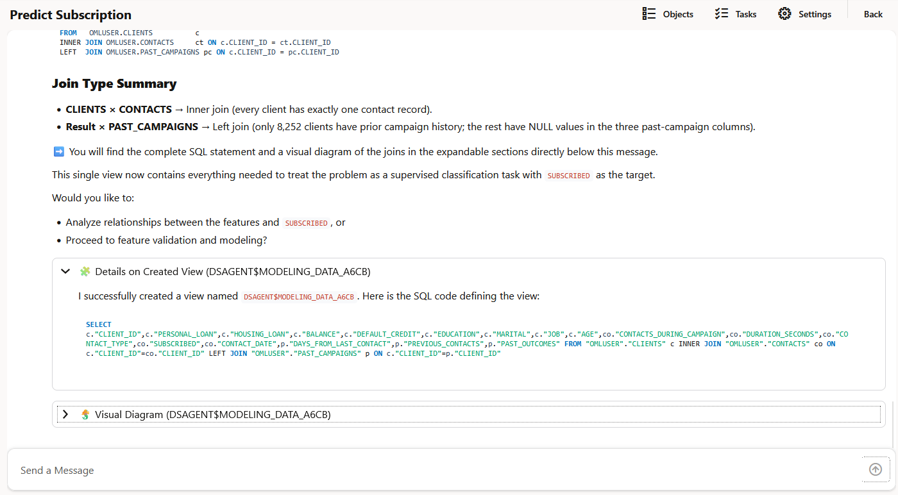

    >**Note:**  The outputs in this lab are examples only. The suffixes, selected algorithm, metrics, and row counts may differ in your environment. Use the object names generated in your session wherever needed.

## Task 5: Perform feature validation and modeling preparation

In this task, you will ask Data Science Agent to validate features and prepare the modeling data. Feature validation helps identify columns that are suitable for modeling and prepares a clean view for downstream training.

>**Note:**  The outputs in this lab are examples only. The view names, suffixes, selected algorithm, metrics, and row counts may differ in your environment. Use the object names generated in your session wherever needed.

1. Enter the following prompt to continue with feature validation and modeling. This prompt asks Data Science Agent to prepare the unified data for model training.

    ```text
    <copy>
    Proceed with feature validation and modeling.
    </copy>
    ```

    The expected output should look similar to:

    ```text
    Data Science Agent creates the clean modeling view DSAGENT$MODELING_DATA_CLEAN_A6CB, prepares it for modeling, and provides next step options.
    ```

2. Review the response showing the creation of `DSAGENT$MODELING_DATA_CLEAN_A6CB`, the SQL code, the visual diagram, and the suggested next steps.

    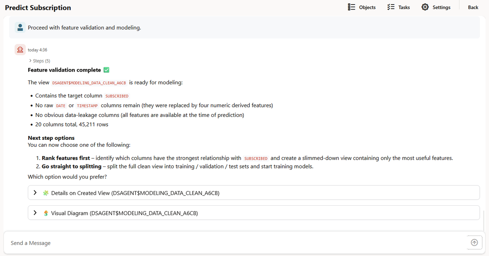


## Task 6: Split the data, train models, and evaluate the final model

In this task, you will ask Data Science Agent to split the clean modeling view into training, validation, and test sets. Data Science Agent uses the clean view for model training and evaluation, splitting the data into 70% training, 10% validation, and 20% test.

>**Note:**  The outputs in this lab are examples only. The view names, model names, suffixes, selected algorithm, metrics, and row counts may differ in your environment. Use the object names generated in your session wherever needed.

1. Enter the following prompt to split the clean view and start model training. This prompt starts the model development stage of the workflow.

    ```text
    <copy>
    Proceed with splitting the clean view into training, validation, and test sets. Then start training the models.
    </copy>
    ```

    The expected output should look similar to:

    ```text
    Data Science Agent creates DSAGENT$MODELING_DATA_CLEAN_A6CB_TRAIN with 31,750 rows, DSAGENT$MODELING_DATA_CLEAN_A6CB_VAL with 4,461 rows, and DSAGENT$MODELING_DATA_CLEAN_A6CB_TEST with 9,000 rows.
    ```

2. Review the response showing the data split summary and the start of model training. Data Science Agent uses the clean view `OMLUSER.DSAGENT$MODELING_DATA_CLEAN_A6CB` and selects Neural Network as the best algorithm for this machine learning problem.

    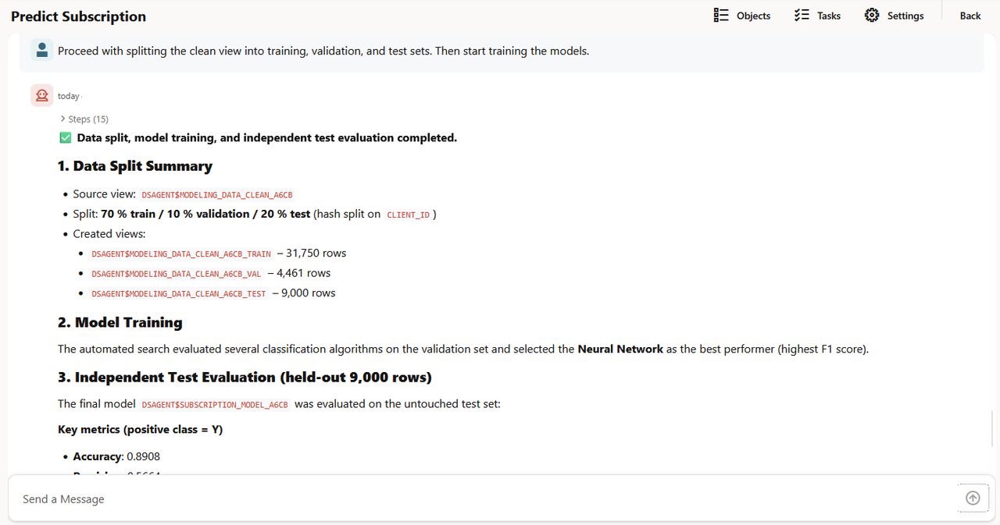

3. Review the response showing details of the final model build and evaluation.

    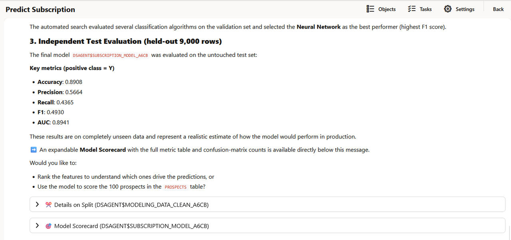

    The expected output should look similar to:

    ```text
    Data Science Agent builds and evaluates the final model DSAGENT$SUBSCRIPTION_MODEL_A6CB.
    ```

4. Review the scorecard for the model `OMLUSER.DSAGENT$SUBSCRIPTION_MODEL_A6CB`, including model metrics and the binary confusion matrix.

    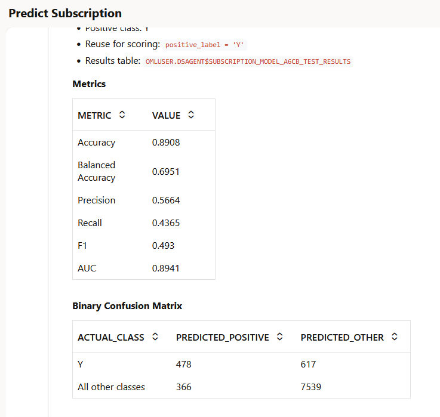

    The expected output should look similar to:

    ```text
    Model Name: OMLUSER.DSAGENT$SUBSCRIPTION_MODEL_A6CB
    Metrics: Accuracy, Precision, Recall, F1, and AUC
    Evaluation: Binary confusion matrix displayed for subscribed and not subscribed classes
    ```

5. Open the **Models** page and verify that the final model `OMLUSER.DSAGENT$SUBSCRIPTION_MODEL_A6CB` is listed.

    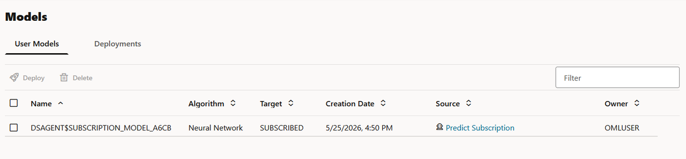

## Task 7: Score prospects to predict subscription likelihood

In this task, you will ask Data Science Agent to use the trained model to score the 100 prospects in the `PROSPECTS` table. Scoring applies the trained model to new or prospective clients and returns a predicted subscription value and probability.

>**Note:**  The outputs in this lab are examples only. The view names, model names, suffixes, selected algorithm, metrics, and row counts may differ in your environment. Use the object names generated in your session wherever needed.

1. Enter the following prompt to score the 100 prospects. This prompt asks Data Science Agent to use the trained model for inference on the `PROSPECTS` table.

    ```text
    <copy>
    Use the model to score the 100 prospects in the PROSPECTS table
    </copy>
    ```

    The expected output should look similar to:

    ```text
    Data Science Agent scores 100 prospective clients in the PROSPECTS table and returns subscription predictions with probability values.
    ```

2. Review the prediction table showing the probability of subscription for the prospects.

    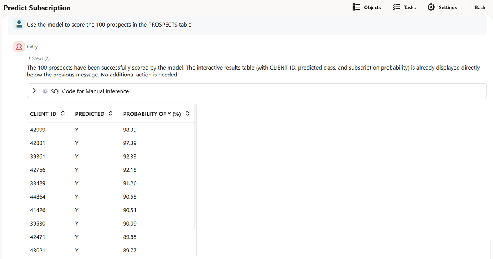

3. Review the SQL query provided by Data Science Agent to run the inference manually.

    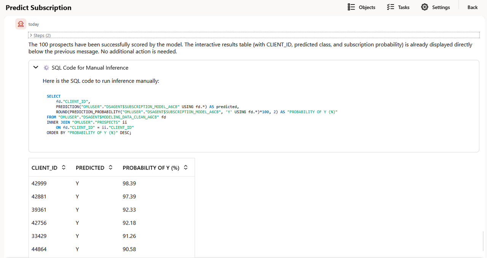

    The expected output should look similar to:

    ```text
    CLIENT_ID    PREDICTION    PREDICTION_PROBABILITY
    42001        1             89.28
    42002        0             84.11
    42003        1             78.46
    42004        0             91.03
    ```

## Learn More

* [Oracle Machine Learning](https://docs.oracle.com/en/database/oracle/machine-learning/)
* [Oracle Data Science Agent](https://docs.oracle.com/en/database/oracle/machine-learning/data-science-agent/index.html)
* [Oracle Autonomous Database](https://docs.oracle.com/en/cloud/paas/autonomous-database/)
* [Oracle LiveLabs](https://oracle-livelabs.github.io/)

## Acknowledgements

* **Author** - Moitreyee Hazarika, Consulting User Assistance Developer, Oracle AI Database User Assistance Development
* **Contributors** - Mark Hornick, Senior Director, Data Science and Machine Learning; Marcos Arancibia Coddou, Product Manager, Oracle Data Science; Sherry LaMonica, Consulting Member of Tech Staff, Machine Learning
* **Last Updated By/Date** - Moitreyee Hazarika, June 2026
