# Issue prompts to perform Data Science and Machine Learning tasks

## Introduction

In this lab, you will issue a sequence of prompts to Data Science Agent to perform data science and machine learning tasks. You will run a complete machine learning workflow using natural language, progressing from general questions about the data in the `OMLUSER` schema to model training, model building, evaluation, and scoring.

By the end of this lab, you will see how Data Science Agent supports a novice user in exploring the dataset present in the `OMLUSER` schema and in building and evaluating a machine learning model. You will use natural language to prepare data, generate SQL, create visualizations, train models, interpret model results, and score prospects.

>**Note:** This is an agent-driven workflow. Outputs can vary by model, profile, seed, data state, and previous conversation context. Your generated object names and model results may differ. Use the names shown in your response.

Estimated Time: X

### Objectives

In this lab, you will:
* Set the goal and context for a Data Science Agent conversation
* Explore the `CLIENTS`, `CONTACTS`, `PAST_CAMPAIGNS`, and `PROSPECTS` tables
* Frame subscription likelihood as a machine learning problem
* Create a single modeling table from multiple source tables
* Perform feature validation and prepare a clean modeling view
* Split data into training, validation, and test sets
* Train and evaluate a model to predict subscription likelihood
* Score prospects by using the trained model

### Prerequisites

This lab assumes you have:
* Completed all previous labs
* Access to Data Science Agent
* The `CLIENTS`, `CONTACTS`, `PAST_CAMPAIGNS`, and `PROSPECTS` tables added as Associated Objects
* Access to the `OMLUSER` schema

>**Note:**  The output in this lab are examples. The suffixes, selected algorithm, metrics, row counts, and names of models and views may differ when you run the workshop in your environment. Use the object names generated in your session wherever needed.

## Task 1: Set the conversation goal and context

In this task, continue the `Predict Subscription` conversation you created in Lab 3: Create a Data Science Conversation. Provide enough context for the agent to understand your role, your experience level, and the data you want to explore. This helps the agent tailor its response and explain the machine learning workflow in an accessible way.

1. Open the `Predict Subscription` conversation, and review the tips displayed in the chat interface.

    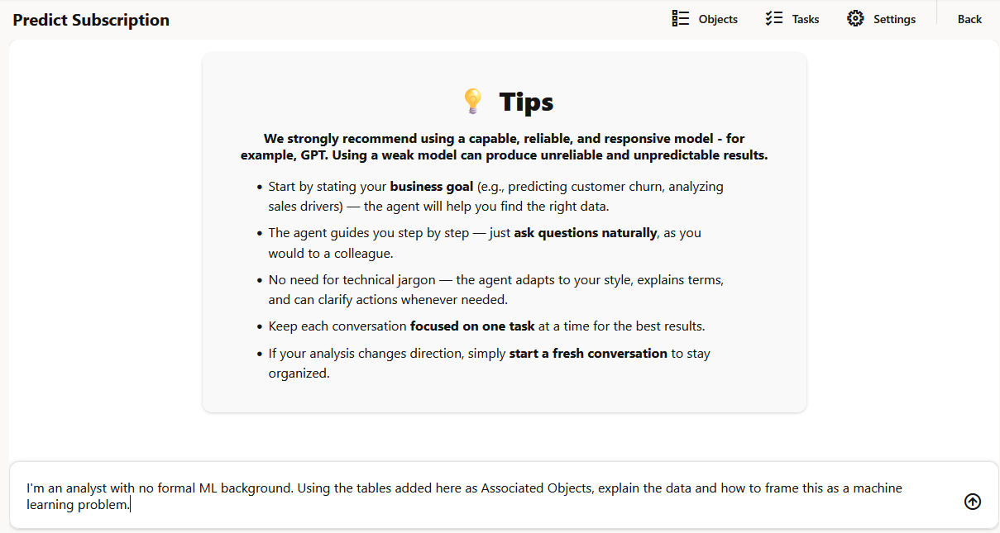

2. Enter the following prompt to set the goal and context for the conversation. This prompt tells Data Science Agent that you are an analyst without formal machine learning experience and asks it to explain the data and the machine learning framing.

    ```text
    <copy>
    I'm an analyst with no formal ML background. Using the tables added here as Associated Objects, explain the data and how to frame this as a machine learning problem.
    </copy>
    ```

    In this example, Data Science Agent summarizes the available tables, describes key columns, and explains how the data can be framed as a supervised machine learning problem.

3. Review the summary of the data in each table and the key columns identified by Data Science Agent.

    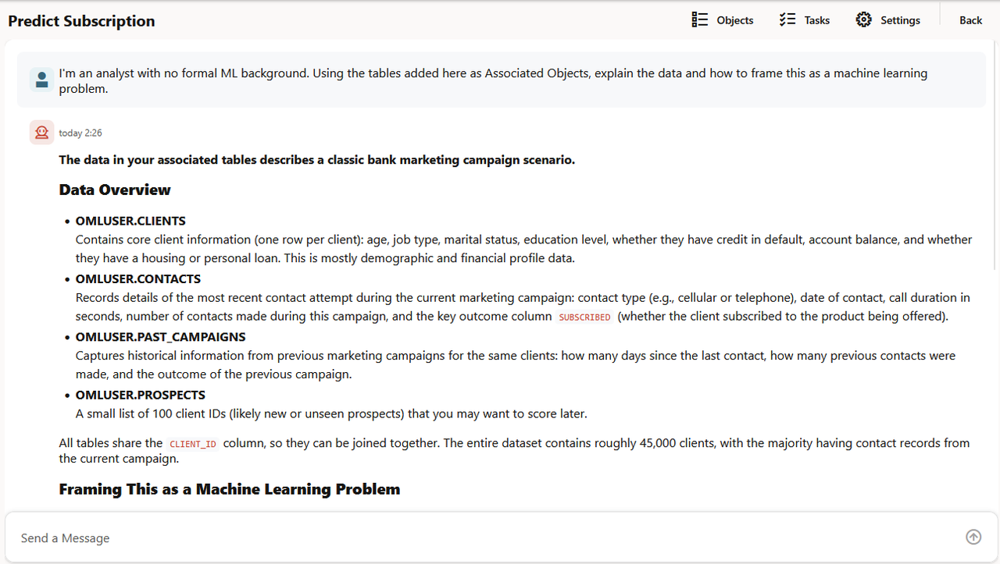

4. Review the explanation of how to frame a machine learning problem, the steps required to frame the problem, and the summary of the dataset.

    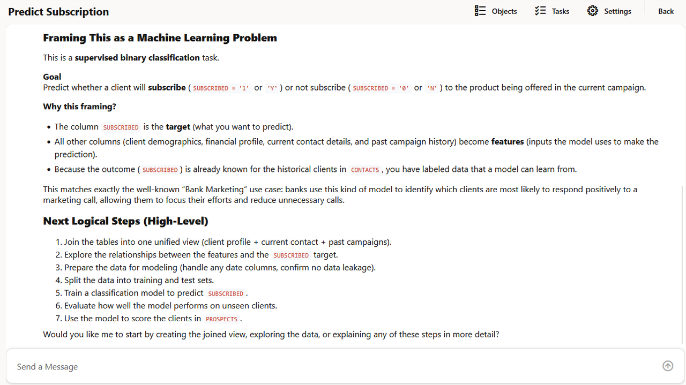

## Task 2: Explore the dataset

In this task, you will ask Data Science Agent to explore the dataset and provide basic statistics. This helps you understand table contents, attribute distributions, and data patterns before moving into feature engineering and modeling.

1. Enter the following prompt to request basic statistics about the available data. This prompt asks Data Science Agent to inspect the Associated Objects and summarize the dataset in a structured way.

    ```text
    <copy>
    Show some basic statistics about the data.
    </copy>
    ```

    In this example, Data Science Agent returns the insights for the CLIENTS, CONTACTS, PAST_CAMPAIGNS, and PROSPECTS tables, including row-level summaries and attribute-level statistics.

2. Review the initial response, including the insight on the `CLIENTS`, `CONTACTS`, `PAST_CAMPAIGNS`, and `PROSPECTS` tables.

    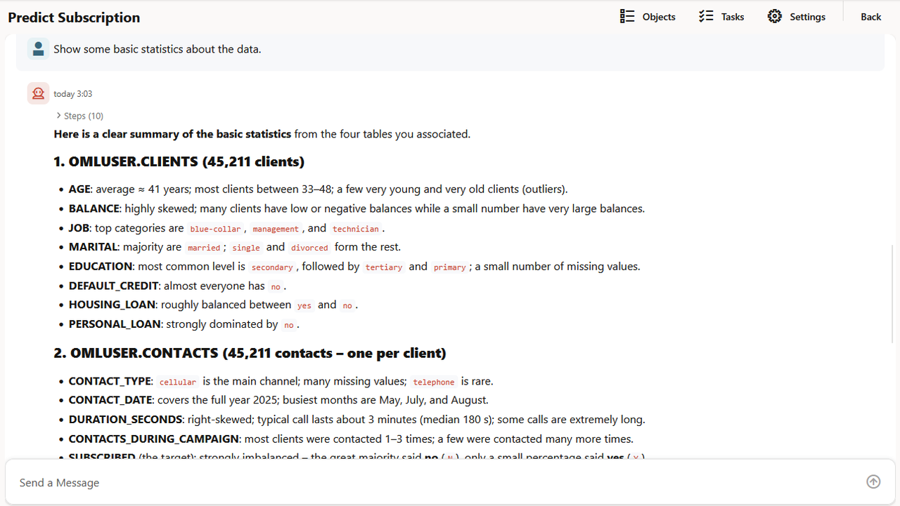

3. Expand the **Attribute Statistic** section for each table. Data Science Agent presents statistical analysis in a tabular format and, where applicable, as graphs. Data Science Agent generates the attribute statistics for each table. Numeric columns show values such as counts, minimums, maximums, averages, and distributions.

    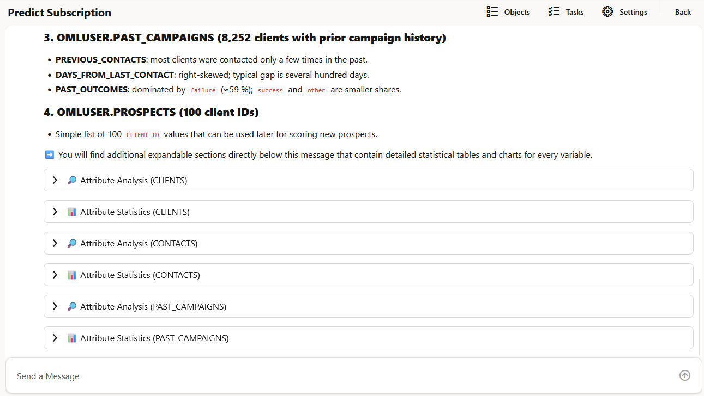

4. Expand the **Attribute Analysis** section for each table. Data Science Agent presents attribute-level analysis in a tabular format and, where applicable, as graphs.

    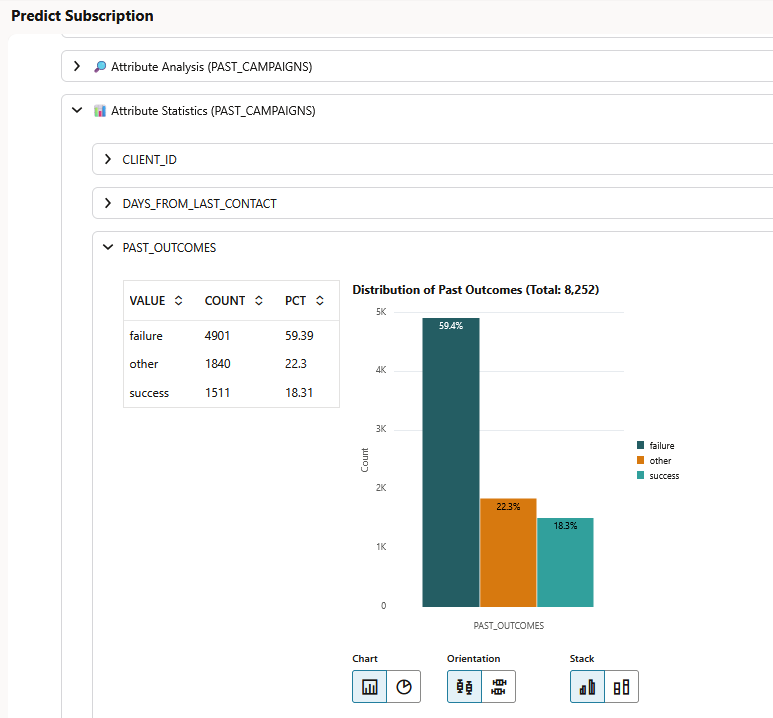

## Task 3: Frame the data as a machine learning problem

In this task, you will ask Data Science Agent to explain how the available tables can be used to predict subscription likelihood. This establishes the target variable, candidate input features, and the overall supervised learning setup.

1. Enter the following prompt to ask Data Science Agent to frame the use case as a machine learning problem. This prompt focuses the conversation on predicting subscription likelihood and asks for the target variable and possible input features.

    ```text
    <copy>
    Explain how to frame this as a machine learning problem to predict subscription likelihood. Explain the target variable and the possible input features.
    </copy>
    ```

    In response to this prompt, Data Science Agent should return the prediction goal, identify the target variable, and list candidate input features from the available tables.


2. Review the explanation of how to frame the machine learning problem and how the target variable is defined.

    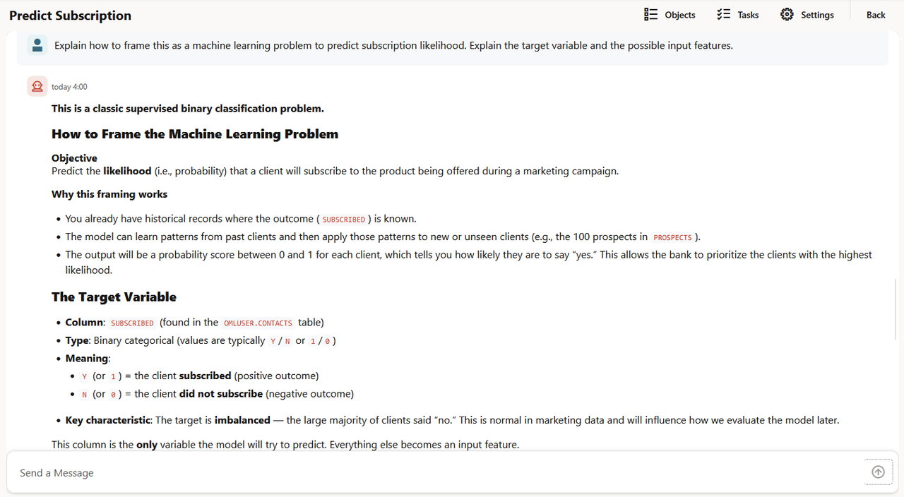

3. Review the input feature explanation, the summary of the machine learning setup, and the suggested next steps.

    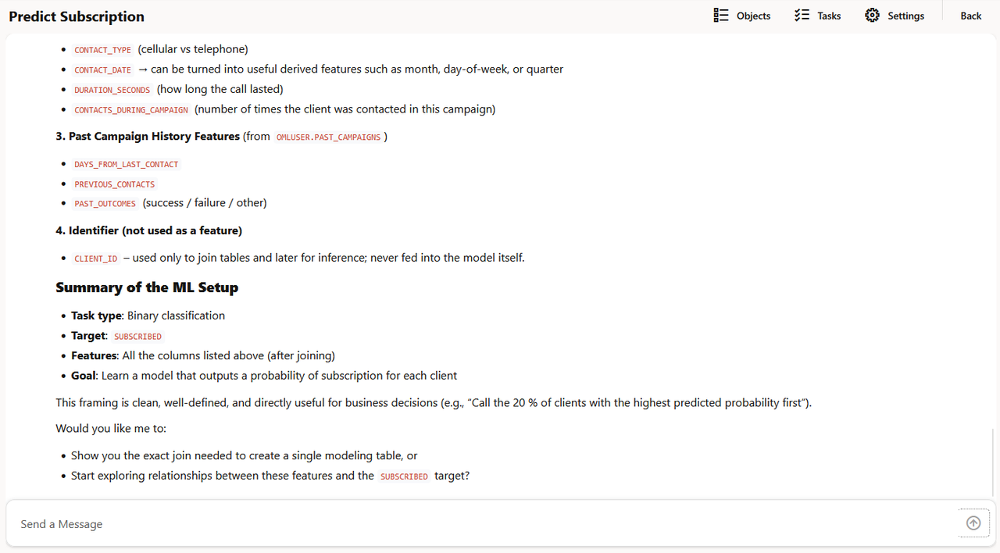

## Task 4: Create a single modeling table

In this task, you will ask Data Science Agent to show the joins required to create a single modeling table. A single modeling table is useful because model training typically requires one row per training example with the target variable and input features in the same dataset.

1. Enter the following prompt to ask Data Science Agent to create the unified modeling table and show the exact joins. This prompt moves the workflow from conceptual framing into data preparation.

    ```text
    <copy>
    Yes. Show the exact joins to create a single modeling table.
    </copy>
    ```

    In this example, Data Science Agent creates the unified modeling view DSAGENT$MODELING_DATA_A6CB and explains the join logic used to combine the source tables. See screenshot in step 2 here.

2. Review the response showing the unified modeling view `DSAGENT$MODELING_DATA_A6CB`, the summary of the view, and the explanation of the join logic.

    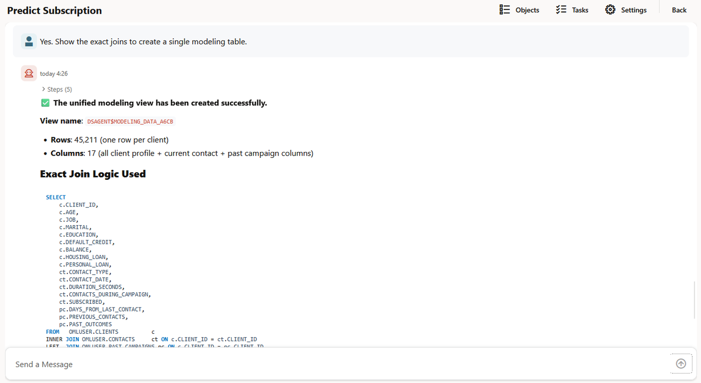

    > **Note:** Views and objects created by Data Science Agent have the prefix `DSAGENT$`.

3. Review the join type summary, generated SQL code, and visual diagram for the view.

    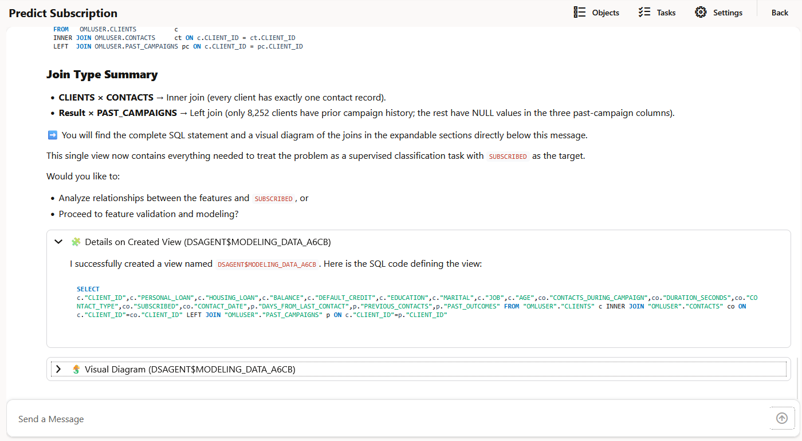

    >**Note:**  The outputs in this lab are examples only. The suffixes, selected algorithm, metrics, and row counts may differ in your environment. Use the object names generated in your session wherever needed.

## Task 5: Perform feature validation and modeling preparation

In this task, you will ask Data Science Agent to validate features and prepare the modeling data. Feature validation helps identify columns that are suitable for modeling and prepares a clean view for downstream training.

>**Note:**  The outputs in this lab are examples only. The view names, suffixes, selected algorithm, metrics, and row counts may differ in your environment. Use the object names generated in your session wherever needed.

1. Enter the following prompt to continue with feature validation and modeling. This prompt asks Data Science Agent to prepare the unified data for model training.

    ```text
    <copy>
    Proceed with feature validation and modeling.
    </copy>
    ```

    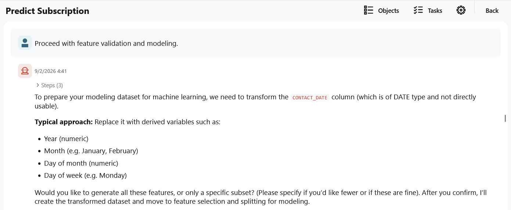

    In this example, Data Science Agent suggests transforming the `CONTACT_DATE` column, which is of DATE type but not directly usable. It suggests how to approach it and asks whether to generate all these features, or only a specific subset. Based on the user input, the agent clearly mentiones that it will create the transformed dataset, and then move to feature selection and data splitting for modeling.

2. Review the response and enter the following prompt to transform the CONTACT_DATE column.

    ```text
    <copy>
    Yes, go ahead and transform  the CONTACT_DATE column.
    </copy>
    ```

    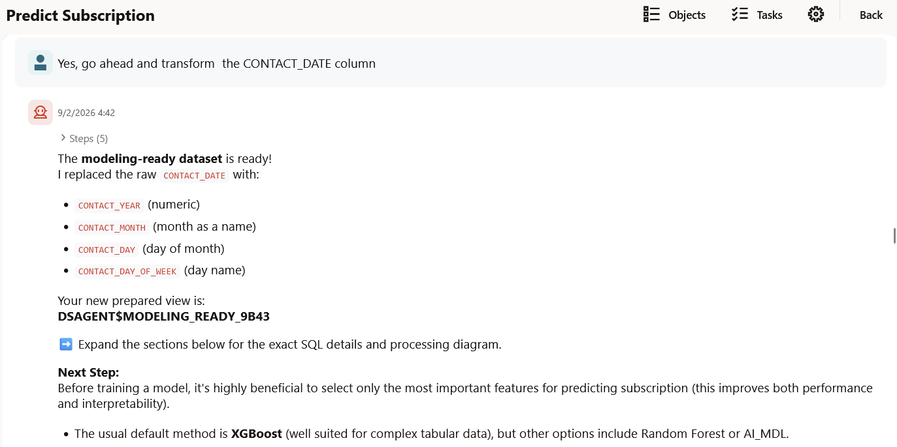

    Data Science Agent transforms the CONTACT_DATE column, and replaces it with these columns - CONTACT_YEAR (numeric), CONTACT_MONTH (month as a name), CONTACT_DAY (day of month), CONTACT_DAY_OF_WEEK (day name). It then creates the view `DSAGENT$MODELING_READY_9B43`. It also provides the SQL code the for the view, and the processing diagram. It also provides the most important suggestion to select only the most important features for predicting subscription, citing the reason that it improves both performance and interpretability.

3. Review the response and enter the following prompt to perform feature engineering for predicting subscription likelihood. Also prompt the agent to identify and suggest useful features and explain the same:

    ```text
    <copy>
    Review the view DSAGENT$MODELING_READY_9B43 and perform feature engineering for predicting subscription likelihood. Identify potentially useful derived features from the available columns, and explain why they may be useful.
    </copy>
    ```
    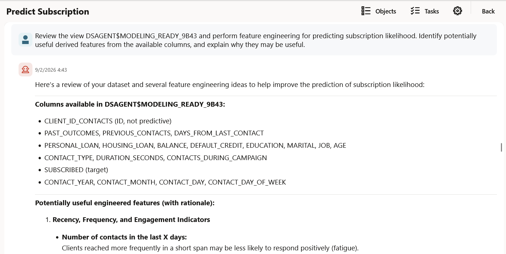

    Data Science Agent provides a review of the dataset and suggests several feature engineering ideas to help improve the prediction of subscription likelihood. It provides a detailed list of potentially useful engineered features:

    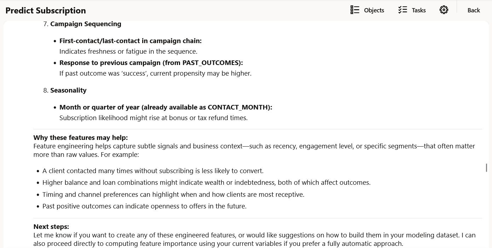
    Here is a detailed list of potentially useful engineered features with rationale provided by Data Science Agent. The agent also provides the following options:
    * Create any of the engineered features
    * Suggestions on how to build the engineered features in the modeling dataset
    * Adopt a fully automatic approach by compute feature importance using the current variables

4. Next, let's proceed to create a new view to include the engineered features. Enter the following prompt: 

    ```text
    <copy>
    Create a new view that includes the engineered features.
    </copy>
    ```

    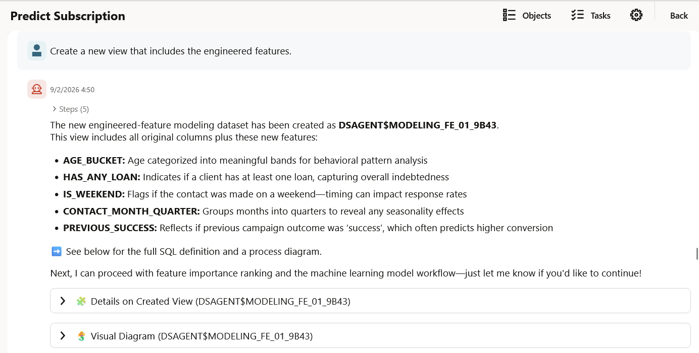

    Data Science agent creates the new view `DSAGENT$MODELING_FE_01_9B43` with all the original columns along with these new features - `AGE_BUCKET`, `HAS_ANY_LOAN`, `IS_WEEKEND`, `CONTACT_MONTH_QUARTER`, and `PREVIOUS_SUCCESS`.

    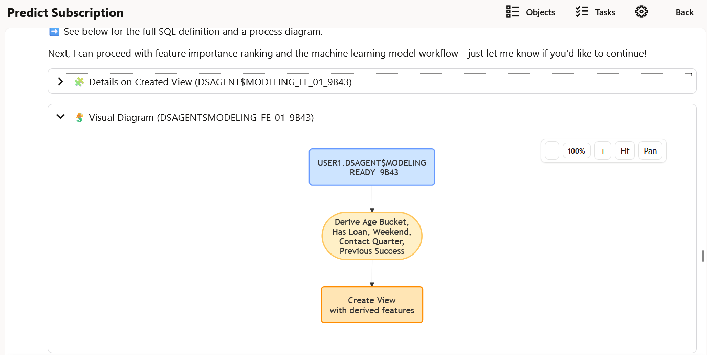

    It also provides the full SQL definition and a process diagram.

5. Let's confirm if there's any data leakage issues with the feature `HAS_ANY_LOAN`. This feature indicates if a client has at least one loan, capturing overall indebtedness. Enter the following prompt:

    ```text
    <copy>
    Confirm that HAS_ANY_LOAN uses only information available before the prediction is made. Assume the prediction is made before the current campaign contact. If there is a concern, explain it and do not create the feature.
    </copy>
    ```
    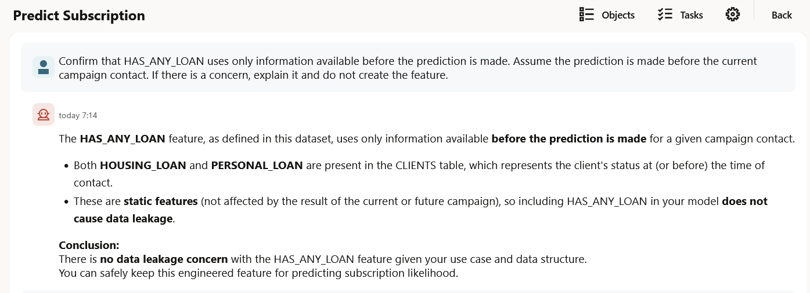

    Data Science Agent analyses the feature and confirms that it uses only information available before the prediction is made for a given campaign contact. It suggests that it is safe to retain this engineered feature for predicting subscription likelihood.

6. Let's add the feature `HAS_ANY_LOAN` to the new view `DSAGENT$MODELING_FE_ANYLOAN_9B43`. Enter the following prompt: 

    ```text
    <copy>
    Create an engineered feature called HAS_ANY_LOAN. Set it to 1 if either HOUSING_LOAN or PERSONAL_LOAN is 1, otherwise set it to 0. Explain why this feature may help predict subscription likelihood.
    </copy>
    ```

    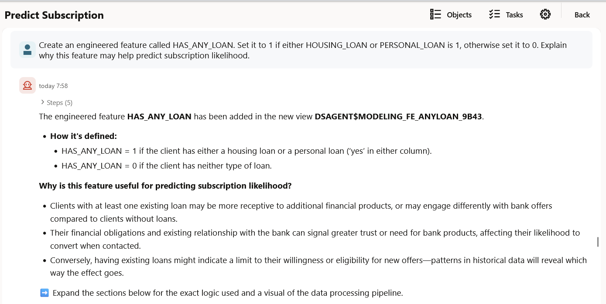

    Data Science Agent now adds the engineered feature `HAS_ANY_LOAN` to the view `DSAGENT$MODELING_FE_ANYLOAN_9B43`. See screenshot above for information on how it has defined the feature and how it helps in predicting subscription likelihood.
7. 


    ```text
    <copy>
    Create a new view that includes the original columns and HAS_ANY_LOAN.
    </copy>
    ```
    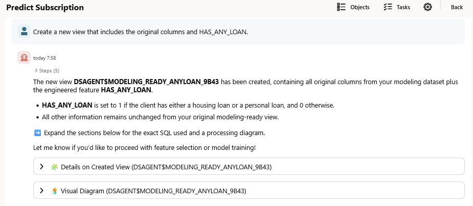

    Data Science Agent creates the view `DSAGENT$MODELING_READY_ANYLOAN_9B43` containing all original columns from the modeling dataset and the engineered feature `HAS_ANY_LOAN`.


## Task 6: Split the data, train models, and evaluate the final model

In this task, you will ask Data Science Agent to split the clean modeling view into training, validation, and test sets. Data Science Agent uses the clean view for model training and evaluation, splitting the data into 70% training, 10% validation, and 20% test.

>**Note:**  The outputs in this lab are examples only. The view names, model names, suffixes, selected algorithm, metrics, and row counts may differ in your environment. Use the object names generated in your session wherever needed.

1. Enter the following prompt to split the clean view and start model training. This prompt starts the model development stage of the workflow.

    ```text
    <copy>
    Proceed with splitting the clean view into training, validation, and test sets. Then start training the models.
    </copy>
    ```

    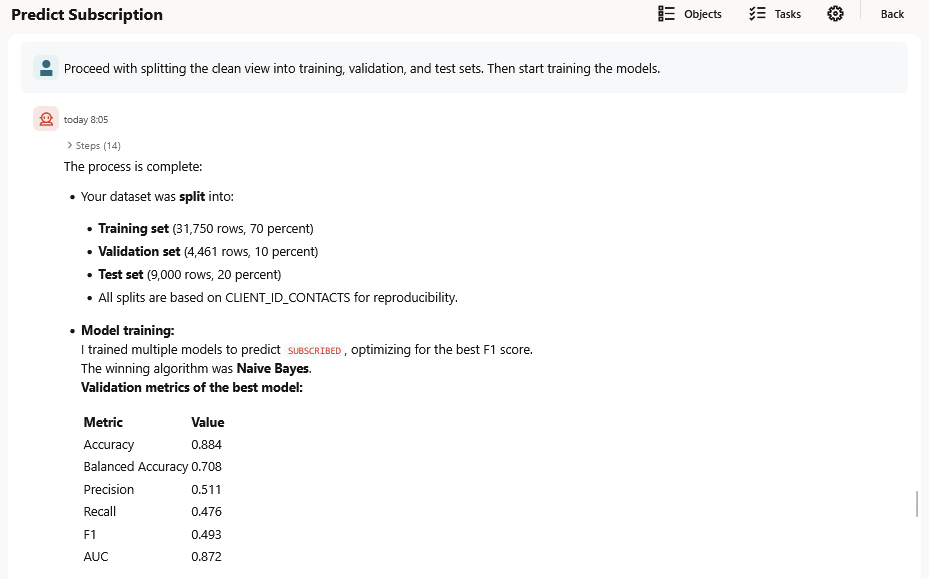
    In response to this prompt, Data Science Agent does the following:
    * Split the dataset into Training set (31,750 rows, 70 percent), Validation set (4,461 rows, 10 percent), and Test set (9,000 rows, 20 percent). 
    * Trained multiple models to predict SUBSCRIBED, optimizing for the best F1 score. 
    * Created the table  table `DSAGENT$SUBSCRIBER_CLASSIFIER_VALIDATION_9B43`. 
    * Built the final model `DSAGENT$ML_SUBSCRIBER_CLASSIFIER_9B43` and trained it on the combined training and validation data.

2. Review the response showing the data split summary. Data Science Agent uses the clean view `USER1.DSAGENT$MODELING_READY_ANYLOAN_9B43` and selects Naive Bayes as the best algorithm for this machine learning problem.

    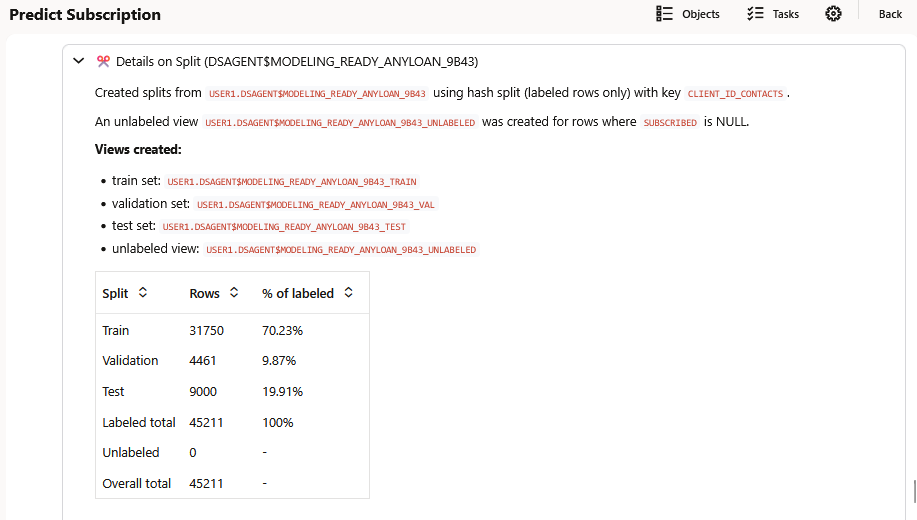

3. Review the scorecard for the model `DSAGENT$ML_SUBSCRIBER_CLASSIFIER_9B43`:

    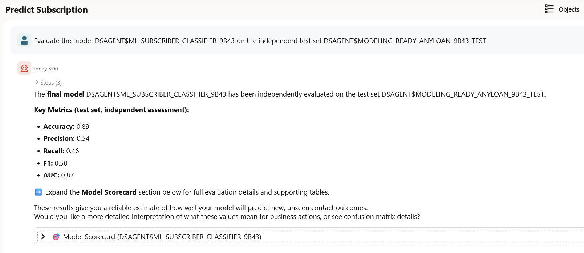

    Review the model metrics and the binary confusion matrix:
    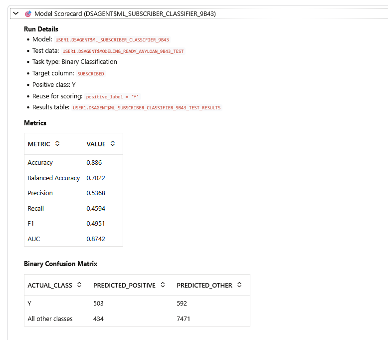

4. Open the **Models** page and verify that the final model `DSAGENT$ML_SUBSCRIBER_CLASSIFIER_9B43` is listed.

    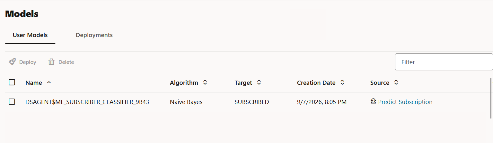

## Task 7: Score prospects to predict subscription likelihood

In this task, you will ask Data Science Agent to use the trained model to score the 100 prospects in the `PROSPECTS` table. Scoring applies the trained model to new or prospective clients and returns a predicted subscription value and probability.

>**Note:**  The outputs in this lab are examples only. The view names, model names, suffixes, selected algorithm, metrics, and row counts may differ in your environment. Use the object names generated in your session wherever needed.

1. Enter the following prompt to score the 100 prospects. This prompt asks Data Science Agent to use the trained model for inference on the `PROSPECTS` table.

    ```text
    <copy>
    Use the model to score the 100 prospects in the PROSPECTS table
    </copy>
    ```

    In this example, Data Science Agent scores 100 prospective clients in the PROSPECTS table and returns subscription predictions with probability values.

2. Review the prediction table showing the probability of subscription for the prospects.

    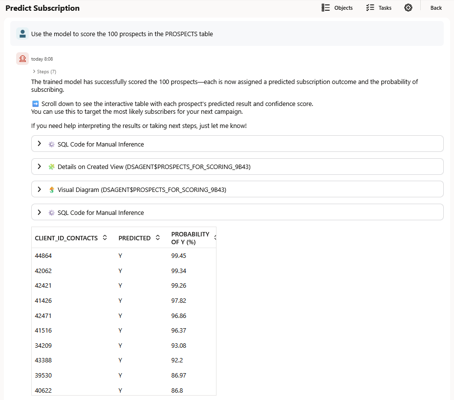

3. Review the details on the view `DSAGENT$PROSPECTS_FOR_SCORING_9B43`. 

    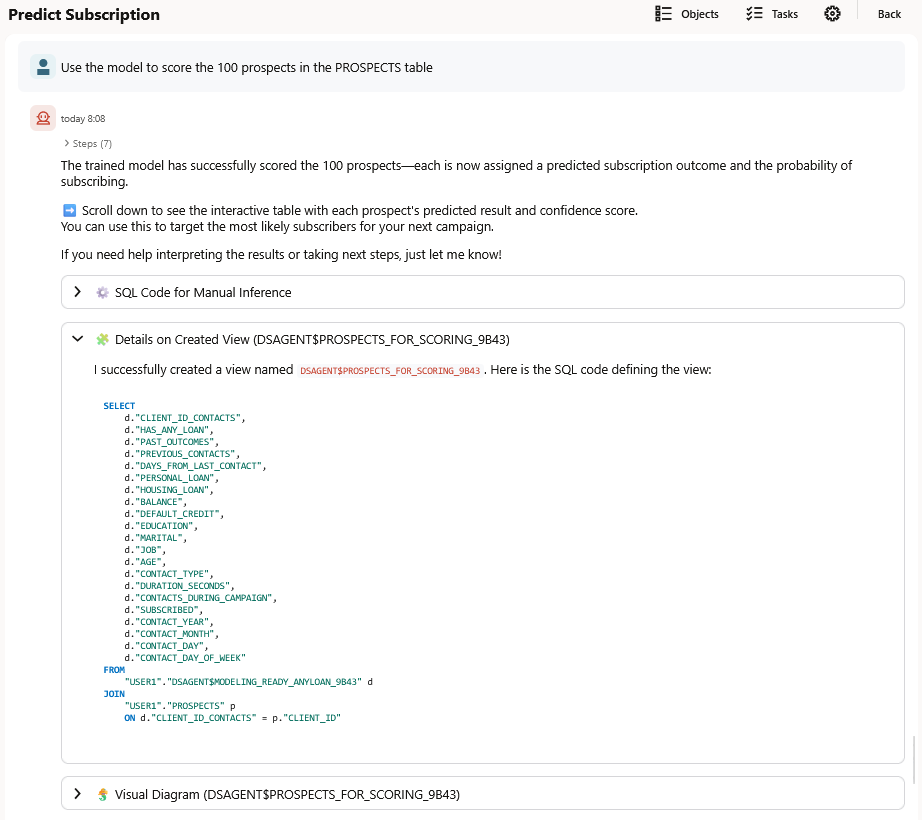


4. Review the SQL query provided by Data Science Agent to run the inference manually.

    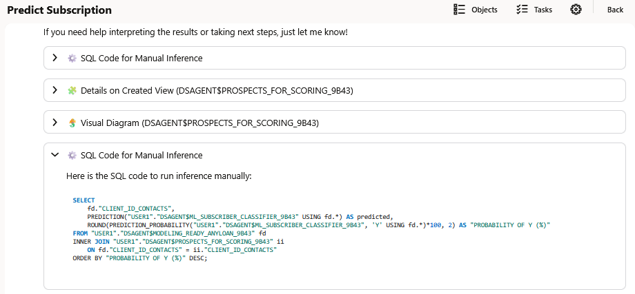

5. Review the visual diagram provided by Data Science Agent to create the view `DSAGENT$PROSPECTS_FOR_SCORING_9B43`.

    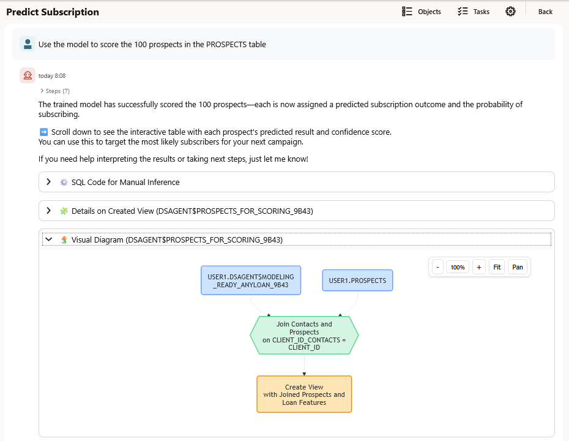

    In this example, Data Science Agent returns the following:

    ```
    | CLIENT_ID_CONTACTS | PREDICTED | PROBABILITY OF Y (%) |

    |---:|:---:|---:|
    | 44864 | Y | 99.45 |
    | 42062 | Y | 99.34 |
    | 42421 | Y | 99.26 |
    | 41426 | Y | 97.82 |
    | 42471 | Y | 96.86 |
    | 41516 | Y | 96.37 |
    | 34209 | Y | 93.08 |
    | 43388 | Y | 92.2 |
    | 39530 | Y | 86.97 |
    | 40622 | Y | 86.8 |
    | 15737 | Y | 86.29 |
    | 33972 | Y | 84.12 |
    | 33871 | Y | 82.69 |
    | 42881 | Y | 68.49 |
    | 39606 | Y | 67.96 |
    | 44398 | Y | 64.44 |
    | 39361 | Y | 63.91 |
    | 42999 | Y | 61.79 |
    | 29400 | Y | 60.38 |
    | 39974 | N | 47.78 |
    | 7803 | N | 42.63 |
    | 42271 | N | 41.64 |
    | 28803 | N | 40.74 |
    | 34337 | N | 40.11 |
    | 32365 | N | 38.94 |
    | 31511 | N | 30.42 |
    | 29635 | N | 30.16 |
    | 43021 | N | 28.6 |
    | 20560 | N | 28.2 |
    | 28092 | N | 27.29 |
    | 42756 | N | 25.7 |
    | 12261 | N | 24.73 |
    | 13147 | N | 21.18 |
    | 43531 | N | 20.51 |
    | 34756 | N | 19.81 |
    | 28649 | N | 19.25 |
    | 43691 | N | 18.76 |
    | 33429 | N | 17.15 |
    | 35610 | N | 16.55 |
    | 32596 | N | 15.81 |
    | 19727 | N | 15.55 |
    | 13693 | N | 14.16 |
    | 19884 | N | 14.02 |
    | 35599 | N | 13.18 |
    | 19622 | N | 11.07 |
    | 28653 | N | 9.73 |
    | 28122 | N | 9.16 |
    | 8245 | N | 8.01 |
    | 21997 | N | 7.72 |
    | 38629 | N | 7.21 |
    | 11943 | N | 6.54 |
    | 16154 | N | 6.04 |
    | 18175 | N | 5.86 |
    | 19347 | N | 5.84 |
    | 9371 | N | 5.71 |
    | 33840 | N | 5.62 |
    | 13506 | N | 5.26 |
    | 19187 | N | 5.14 |
    | 9900 | N | 4.09 |
    | 38445 | N | 4 |
    | 21200 | N | 3.89 |
    | 32507 | N | 3.78 |
    | 27938 | N | 3.26 |
    | 5756 | N | 3.01 |
    | 33168 | N | 2.89 |
    | 23293 | N | 2.75 |
    | 27509 | N | 2.25 |
    | 23692 | N | 2.24 |
    | 35231 | N | 2.07 |
    | 12945 | N | 1.87 |
    | 26416 | N | 1.75 |
    | 26727 | N | 1.56 |
    | 18373 | N | 1.45 |
    | 12686 | N | 1.43 |
    | 33149 | N | 1.41 |
    | 11472 | N | 1.34 |
    | 10157 | N | 1.34 |
    | 23828 | N | 1.32 |
    | 5752 | N | 1.21 |
    | 3122 | N | 1.15 |
    | 36589 | N | 0.92 |
    | 1522 | N | 0.66 |
    | 34440 | N | 0.54 |
    | 3245 | N | 0.53 |
    | 19715 | N | 0.48 |
    | 35627 | N | 0.47 |
    | 3995 | N | 0.45 |
    | 4712 | N | 0.35 |
    | 6609 | N | 0.32 |
    | 35998 | N | 0.3 |
    | 34426 | N | 0.25 |
    | 15421 | N | 0.21 |
    | 300 | N | 0.15 |
    | 5346 | N | 0.14 |
    | 15249 | N | 0.14 |
    | 23636 | N | 0.14 |
    | 17138 | N | 0.04 |
    | 24120 | N | 0.03 |
    | 38748 | N | 0.01 |
    | 18254 | N | 0.01 |
    ```

## Learn More

* [Oracle Machine Learning](https://docs.oracle.com/en/database/oracle/machine-learning/)
* [Oracle Data Science Agent](https://docs.oracle.com/en/database/oracle/machine-learning/data-science-agent/index.html)
* [Oracle Autonomous Database](https://docs.oracle.com/en/cloud/paas/autonomous-database/)
* [Oracle LiveLabs](https://livelabs.oracle.com/ords/r/dbpm/livelabs/home)

## Acknowledgements

* **Author** - Moitreyee Hazarika, Consulting User Assistance Developer, Oracle AI Database User Assistance Development
* **Contributors** - Mark Hornick, Senior Director, Data Science and Machine Learning; Marcos Arancibia Coddou, Product Manager, Oracle Data Science; Sherry LaMonica, Consulting Member of Tech Staff, Machine Learning
* **Last Updated By/Date** - Moitreyee Hazarika, July 2026
