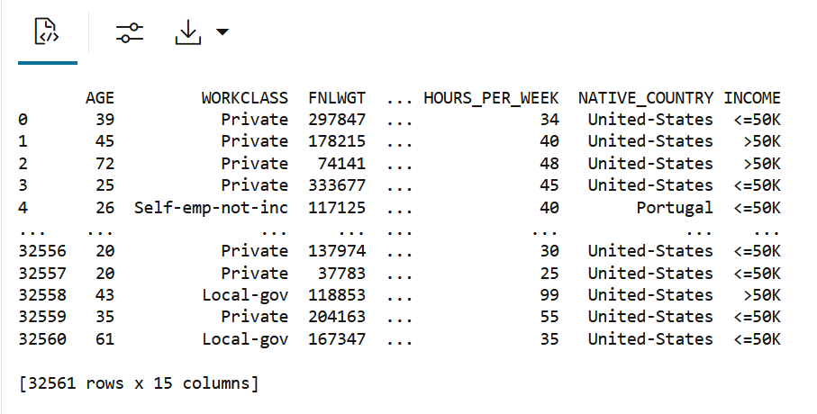
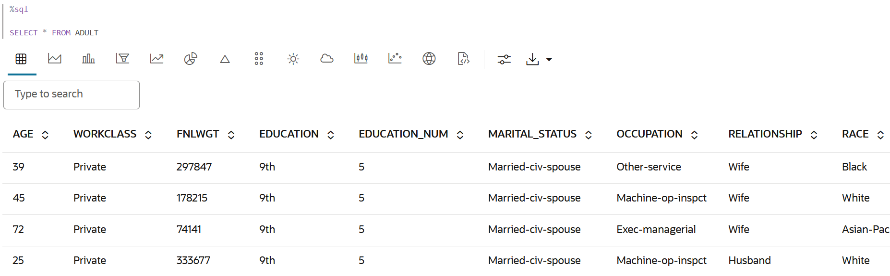
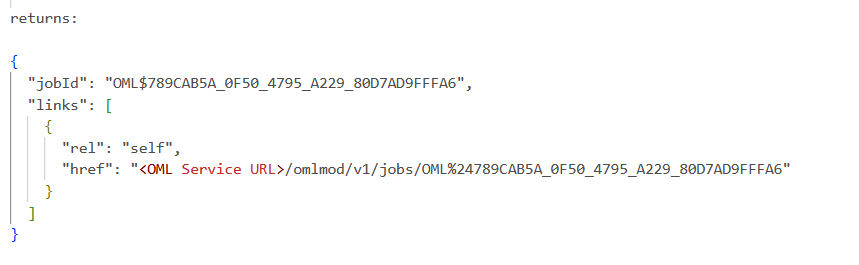
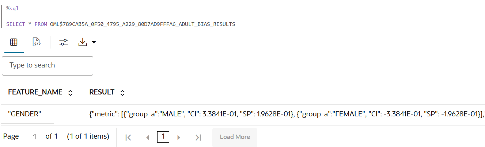
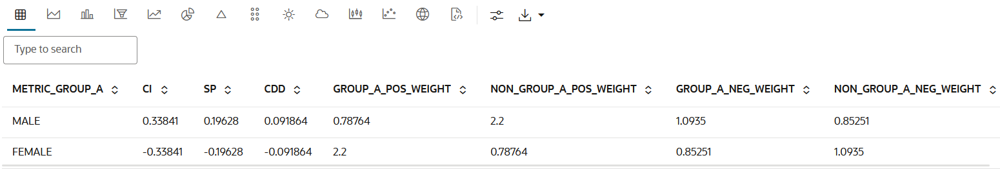
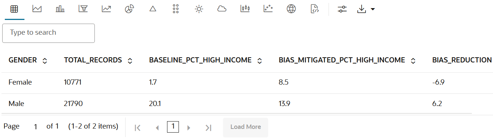

# Create and Run a Data Bias Detection Job Using Oracle Machine Learning REST API

## Introduction

This lab walks you through the steps to create and run a data bias detection job, view the job details, and query the output table to view the data bias details.

Estimated Time: 40 minutes

### About Data Bias Detection in Oracle Machine Learning Services

The OML Services Data Bias Detector provides REST endpoints for creating bias detection jobs. To help identify potential data bias so that you can mitigate effects in later stages, the bias mitigation method **Reweighing** has been added to the `data_bias` API. The Database Bias Detector calculates metrics to identify common types of data bias: Class Imbalance (CI), Statistical Parity (SP), and Conditional Demographic Disparity (CDD). 

### Objectives

In this lab, you will:
* Create and run a data bias detection job
* View details of the data bias detection job
* Query the output table to view the data bias details detected for the sensitive features


### Prerequisites

This lab assumes you have:
* OCI Cloud Shell, which has cURL installed by default. If you are using the Workshops tenancy, you get OCI Cloud Shell as part of the reservation. However, if you are in your own OCI tenancy or using a free trial account, ensure you have OCI Cloud Shell or install cURL for your operating system to run the OML Services commands.
* An Autonomous AI Database instance created in your account/tenancy if you are using your own tenancy or a free trial account. You should have handy the following information for your instance:
    * Your OML user name and password
    * `oml-cloud-service-location-url`
* Completed all previous labs successfully.
* Access to the `Adult` dataset. The dataset used in this example— the **Adult** dataset, also known as the **Census Income** dataset, is a multivariate dataset. It contains census data of `30,940` adults. The prediction task associated with the dataset is to determine whether a person makes over `50K` a year.
* A valid authentication token 


## Task 1: Load the Dataset and Create a Database Table


1. Run the following command in a %python paragraph in your OML notebook to load the Adult dataset into Python memory and create a database table:

    ```
    <copy>
    %python

    import oml

    import pandas as pd
    import ssl

    ssl._create_default_https_context = ssl._create_unverified_context

    url = "https://archive.ics.uci.edu/ml/machine-learning-databases/adult/adult.data"
    columns = ['AGE', 'WORKCLASS', 'FNLWGT', 'EDUCATION', 'EDUCATION_NUM', 'MARITAL_STATUS',
            'OCCUPATION', 'RELATIONSHIP', 'RACE', 'GENDER', 'CAPITAL_GAIN', 'CAPITAL_LOSS',
            'HOURS_PER_WEEK', 'NATIVE_COUNTRY', 'INCOME']
    adult_df = pd.read_csv(url, names=columns, na_values=" ?", skipinitialspace=True)

    try: oml.drop(table="ADULT")
    except: pass

    oml.create(adult_df, table="ADULT")

    </copy>
    ```
    Once the code runs successfully, the table is created. Here is the raw format of the dataframe. 
    

2. In a sql paragraph, run the following command to view the data in a tablular format:

    ```
    <copy>
    %sql
    SELECT * FROM ADULT
    </copy>
    ```
    Here is the ADULT table rendered in your OML notebook: 
    


## Task 2: Build a Baseline Model without Weights

Using the ADULT table, we will now build a model without weights. 

1. To build a baseline model without weights, run the following PL/SQL script:

    ```
    <copy>
    %script

    BEGIN
        DBMS_DATA_MINING.DROP_MODEL('ADULT_UNWEIGHTED');
    EXCEPTION WHEN OTHERS THEN NULL;
    END;
    /

    DECLARE
        v_settings DBMS_DATA_MINING.SETTING_LIST;
    BEGIN
        v_settings('ALGO_NAME') := 'ALGO_GENERALIZED_LINEAR_MODEL';
        
        DBMS_DATA_MINING.CREATE_MODEL2(
            model_name => 'ADULT_UNWEIGHTED',
            mining_function => 'CLASSIFICATION',
            data_query => 'SELECT AGE, EDUCATION, GENDER, HOURS_PER_WEEK, INCOME FROM ADULT',
            set_list => v_settings,
            target_column_name => 'INCOME'
        );
    END;
    </copy>
    ```

    The command returns the following message:
    ```
    PL/SQL procedure successfully completed.
    ```

### Task 2.1: Create a Data Bias Detection job on the Dataset

1. Run the following cURL command to create a data bias detection job on the dataset:

    ```
    <copy>
    $ curl -X POST "<oml-cloud-service-location-url>/omlmod/v1/jobs" \
     --header "Authorization: Bearer <token>" \
     --header 'Content-Type: application/json' \
     --data '{
        "jobProperties": {
           "jobName":"ADULT_BIAS_DETECTION2",
           "jobType":"DATA_BIAS",
           "inputData":"ADULT",
           "outputData":"ADULT_BIAS_RESULTS", 
           "inputSchemaName":"OMLUSER",
           "sensitiveFeatures":["\"GENDER\""],  -- Feature we're testing for bias
           "strata":["\"MARITAL_STATUS\""],     -- Checks bias within each marriage category
           "outcomeColumn":"INCOME",            -- What we're predicting
           "positiveOutcome":">50K"             -- Favorable outcome
        }
     }' | jq
    ```
    This job returns the following:

    
    In this example:

      * `$token` - Represents an environmental variable that is assigned to the token obtained through the  Authorization API.
      * oml-cloud-service-location-url - 
      * `OML$789CAB5A_0F50_4795_A229_80D7AD9FFFA6` - This is the job ID

### Task 2.2: View Details of the Submitted Job 

After the data bias job is submitted successfully, you must connect to the database to access the output table in the output schema. The data bias detection details are available in the output table. 

Note the `inputSchemaName`, `outputSchemaName`, and `outputData`. 

In this example:

* `inputSchemaName` - It is `OMLUSER`
* `outputSchemaName` - It is `OMLUSER`
* `outputData` - This is the output data table. In this example, the name of the output table is `adultbias_tab`.

1. Run the cURL command to view details of the submitted job: 

    ```
    $ export jobid='OML%24789CAB5A_0F50_4795_A229_80D7AD9FFFA6'

    $ curl -X GET "<OML Service URL>/omlmod/v1/jobs/<jobid>  \
        --header 'Accept: application/json' \
        --header 'Content-Type: application/json' \
        --header "Authorization: Bearer <token>" | jq
    </copy>
    ```
    Here, you first create a variable to export the `jobid` using single quotes. Then, you initiate the cURL command with the `jobid` variable to fetch the details of the job.

    In this example,

    * `OML$53D60B34_A275_4B2B_831C_2C8AE40BCB53` - This is the job ID.
    * `ADULTBIAS_TAB` - This is the output table name.
    The command returns the following:
    ```
    <copy>
    {
  "jobId": "OML$789CAB5A_0F50_4795_A229_80D7AD9FFFA6",
  "jobRequest": {
    "jobSchedule": null,
    "jobProperties": {
      "jobType": "DATA_BIAS",
      "inputSchemaName": "OMLUSER",
      "outputSchemaName": null,
      "outputData": "ADULT_BIAS_RESULTS",
      "jobDescription": null,
      "jobName": "ADULT_BIAS_DETECTION2",
      "disableJob": false,
      "jobServiceLevel": null,
      "inputData": "ADULT",
      "sensitiveFeatures": [
        "\"GENDER\""
      ],
      "strata": [
        "\"MARITAL_STATUS\""
      ],
      "outcomeColumn": "INCOME",
      "outcomeThreshold": null,
      "positiveOutcome": ">50K",
      "replaceResultTable": null,
      "pairwiseMode": null,
      "categoricalBinNum": null,
      "numericalBinNum": null
    }
  },
  "jobStatus": "CREATED",
  "dateSubmitted": "2025-09-19T02:36:46.631293Z",
  "links": [
    {
      "rel": "self",
      "href": "<OML Service URL>/omlmod/v1/jobs/OML%24789CAB5A_0F50_4795_A229_80D7AD9FFFA6"
    }
  ],
  "jobFlags": [],
  "state": "SUCCEEDED",
  "enabled": false,
  "lastStartDate": "2025-09-19T02:36:46.960183Z",
  "runCount": 1,
  "lastRunDetail": {
    "jobRunStatus": "SUCCEEDED",
    "errorMessage": null,
    "requestedStartDate": "2025-09-19T02:36:46.928495Z",
    "actualStartDate": "2025-09-19T02:36:46.960299Z",
    "duration": "0 0:0:1.0"
  }
}
    </copy>
    ```

2. In a %sql paragraph in your notebook, run the following to query the output table:

    ```
    <copy>
    %sql

    SELECT * FROM OML$789CAB5A_0F50_4795_A229_80D7AD9FFFA6_ADULT_BIAS_RESULTS

    </copy>
    ```


    The query displays in the details in a table with two columns - **FEATURE_NAME** and **RESULT**. 

    

    The complete result is available here:

    ```
    {"metric": [{"group_a":"MALE", "CI": 3.3841E-01, "SP": 1.9628E-01}, {"group_a":"FEMALE", "CI": -3.3841E-01, "SP": -1.9628E-01}],"cdd": [{"strata": "MARITAL_STATUS", "result": [{"group_a":"MALE", "CDD": 9.1864E-02, "detail": [{"subgroup":"MARRIED-CIV-SPOUSE", "DD": -3.6665E-03},{"subgroup":"NEVER-MARRIED", "DD": 1.1335E-01},{"subgroup":"DIVORCED", "DD": 2.3977E-01},{"subgroup":"SEPARATED", "DD": 3.8267E-01},{"subgroup":"", "DD": 2.6335E-01}]}, {"group_a":"FEMALE", "CDD": -9.1864E-02, "detail": [{"subgroup":"MARRIED-CIV-SPOUSE", "DD": 3.6665E-03},{"subgroup":"NEVER-MARRIED", "DD": -1.1335E-01},{"subgroup":"DIVORCED", "DD": -2.3977E-01},{"subgroup":"SEPARATED", "DD": -3.8267E-01},{"subgroup":"", "DD": -2.6335E-01}]}]}], "reweighing_matrix": [{"group_a":"MALE", "group_a_pos_weight": 7.8764E-01, "non_group_a_pos_weight": 2.2000E+00, "group_a_neg_weight": 1.0935E+00, "non_group_a_neg_weight": 8.5251E-01}, {"group_a":"FEMALE", "group_a_pos_weight": 2.2000E+00, "non_group_a_pos_weight": 7.8764E-01, "group_a_neg_weight": 8.5251E-01, "non_group_a_neg_weight": 1.0935E+00}]}
    ```
### Task 2.3: Parse JSON Results

You can also parse the results in JSON format. Run the following query in a %sql paragraph:
    ```
    <copy>
    %sql

    WITH json_data AS (
        SELECT 
            JSON_QUERY(RESULT, '$.metric') AS Metric_Array,
            JSON_QUERY(RESULT, '$.cdd') AS CDD_Array,
            JSON_QUERY(RESULT, '$.reweighing_matrix') AS ReweighingMatrix_Array
        FROM 
            OML$789CAB5A_0F50_4795_A229_80D7AD9FFFA6_ADULT_BIAS_RESULTS
    )
    SELECT 
        m.group_a AS metric_group_a,
        m.ci,
        m.sp,
        c.cdd,
        r.group_a_pos_weight,
        r.non_group_a_pos_weight,
        r.group_a_neg_weight,
        r.non_group_a_neg_weight
    FROM 
        json_data,
        JSON_TABLE(json_data.Metric_Array, '$[*]'
            COLUMNS (
                group_a VARCHAR2(10) PATH '$.group_a',
                ci NUMBER PATH '$.CI',
                sp NUMBER PATH '$.SP'
            )
        ) m
    JOIN 
        JSON_TABLE(json_data.CDD_Array, '$[*].result[*]'
            COLUMNS (
                group_a VARCHAR2(10) PATH '$.group_a',
                cdd NUMBER PATH '$.CDD'
            )
        ) c
    ON m.group_a = c.group_a
    JOIN 
        JSON_TABLE(json_data.ReweighingMatrix_Array, '$[*]'
            COLUMNS (
                group_a VARCHAR2(10) PATH '$.group_a',
                group_a_pos_weight NUMBER PATH '$.group_a_pos_weight',
                non_group_a_pos_weight NUMBER PATH '$.non_group_a_pos_weight',
                group_a_neg_weight NUMBER PATH '$.group_a_neg_weight',
                non_group_a_neg_weight NUMBER PATH '$.non_group_a_neg_weight'
            )
        ) r
    ON m.group_a = r.group_a;
</copy>
```

The query displays the parsed output in this table:



The bias detector found gender bias in the ADULT dataset:

    Males are favored over females:

    * Men are 19.6% more likely to be predicted as high earners
    * Men make up 33.8% more of the dataset than women

    The **Conditional Demographic Disparity (CDD)** for the groups MALE and FEMALE are 0.091864 and -0.091864 respectively. 
    Note that the sum of the computed CDD for the strata _MARITAL_STATUS_ is zero. This indicates that even after taking _MARITAL_STATUS_ into account, the data is still biased towards the MALE group (as the CDD is positive), and is against the FEMALE group (as the CDD is negative).

    The detector provides specific weights to fix this bias:

    **Reweighting Strategy:**

    * Men earning >50K: Weight = 0.79 (reduce their influence)
    * Men earning ≤50K: Weight = 1.09 (slight increase)
    * Women earning >50K: Weight = 2.20 (boost significantly)
    * Women earning ≤50K: Weight = 0.85 (slight decrease)

    These weights make the model fairer by:

    * Paying less attention to high-earning men (who were overrepresented)
    * Paying more attention to high-earning women (who were underrepresented)
    * Creating more balanced predictions across genders

    The result is a model with more equitable prediction patterns across genders.

## Task 3: Create a Weighted data view using Bias Detection Recommendations

In a %sql paragraph, run the following script to created a dataset with weights:

    <copy>
    %script
    CREATE OR REPLACE VIEW adult_with_weights AS
    SELECT 
        AGE, WORKCLASS, FNLWGT, EDUCATION, EDUCATION_NUM, MARITAL_STATUS, 
        OCCUPATION, RELATIONSHIP, RACE, GENDER, CAPITAL_GAIN, CAPITAL_LOSS,
        HOURS_PER_WEEK, NATIVE_COUNTRY, INCOME,
        CASE 
            -- Apply bias mitigation weights based on OML Services data bias detection results
            -- The bias detector found 19.6% statistical parity difference favoring males
            -- These weights rebalance training data to reduce gender bias in predictions
            
            WHEN GENDER = 'Male' AND INCOME = '>50K' THEN 0.78764
            -- Reduce influence of high-earning males (overrepresented pattern)
            
            WHEN GENDER = 'Male' AND INCOME = '<=50K' THEN 1.0935
            -- Slight increase for low-earning males to maintain balance
            
            WHEN GENDER = 'Female' AND INCOME = '>50K' THEN 2.2000
            -- Significantly boost high-earning females (underrepresented pattern)
            -- This addresses the 33.8% class imbalance against women
            
            WHEN GENDER = 'Female' AND INCOME = '<=50K' THEN 0.85251
            -- Slight decrease for low-earning females to optimize fairness
            
            ELSE 1.0  -- Default weight for any unexpected cases
            
        END as ROW_WEIGHT  
        -- These weights come from the bias detector's reweighting matrix
        -- They minimize both statistical parity and class imbalance
    FROM ADULT;
    </copy>

## Task 4: Build a Bias-mitigated Model with Recommended Weights

    <copy>
    %script

    BEGIN
        DBMS_DATA_MINING.DROP_MODEL('ADULT_WEIGHTED');
    EXCEPTION WHEN OTHERS THEN NULL;
    END;
    /

    DECLARE
        v_settings DBMS_DATA_MINING.SETTING_LIST;
    BEGIN
        v_settings('ALGO_NAME') := 'ALGO_GENERALIZED_LINEAR_MODEL';
        v_settings('ODMS_ROW_WEIGHT_COLUMN_NAME') := 'ROW_WEIGHT';  -- Use bias detection weights
        
        DBMS_DATA_MINING.CREATE_MODEL2(
            model_name => 'ADULT_WEIGHTED',
            mining_function => 'CLASSIFICATION',
            data_query => 'SELECT AGE, EDUCATION, GENDER, HOURS_PER_WEEK, INCOME, ROW_WEIGHT FROM ADULT_WITH_WEIGHTS',
            set_list => v_settings,
            target_column_name => 'INCOME'
        );
    END;
    </copy>


## Task 5: Compare bias mitigation effectiveness

In a %sql paragraph, run the following command to view the comparison of predictions between original/baseline and bias-mitigated models

    <copy>
    %sql
    SELECT GENDER,
        COUNT(*) as TOTAL_RECORDS,
        ROUND(SUM(CASE WHEN unweighted_pred = '>50K' THEN 1 ELSE 0 END) / COUNT(*) * 100, 1) as BASELINE_PCT_HIGH_INCOME,
        ROUND(SUM(CASE WHEN weighted_pred = '>50K' THEN 1 ELSE 0 END) / COUNT(*) * 100, 1) as BIAS_MITIGATED_PCT_HIGH_INCOME,
        ROUND(
            (SUM(CASE WHEN unweighted_pred = '>50K' THEN 1 ELSE 0 END) / COUNT(*) * 100) -
            (SUM(CASE WHEN weighted_pred = '>50K' THEN 1 ELSE 0 END) / COUNT(*) * 100), 1
        ) as BIAS_REDUCTION
    FROM (
        SELECT GENDER,
            PREDICTION(ADULT_UNWEIGHTED USING AGE, EDUCATION, GENDER, HOURS_PER_WEEK) as unweighted_pred,
            PREDICTION(ADULT_WEIGHTED USING AGE, EDUCATION, GENDER, HOURS_PER_WEEK) as weighted_pred
        FROM ADULT
    )
    GROUP BY GENDER
    ORDER BY GENDER;
    </copy>

The results are displayed in a table, as shown here:

   

This completes the task of creating a data bias detection job, and ...

You may now **proceed to the next lab.**


## Learn More

* [REST API for Oracle Machine Learning Services](https://docs.oracle.com/en/database/oracle/machine-learning/omlss/omlss/index.html)
* [Work with Data Bias Detection](https://docs.oracle.com/en/database/oracle/machine-learning/omlss/omlss/omls-data-bias-detector.html)


## Acknowledgements

* **Author** : Moitreyee Hazarika, Consulting User Assistance Developer, Database User Assistance Development
* **Contributors**: Mark Hornick, Senior Director, Data Science and Machine Learning; Marcos Arancibia Coddou, Product Manager, Oracle Data Science; Sherry LaMonica, Consulting Member of Tech Staff, Machine Learning
* **Last Updated By/Date**: Moitreyee Hazarika, October 2025
